# 一、实战篇章


开拓视野就行

## 内存调优

### 内存泄漏和溢出

**内存泄漏（memory leak**）：不再使用一个对象，该对象依然在GC ROOT的引用链上，这个对象就不会被垃圾回收器回收。内存泄漏绝大多数是由堆内存泄漏引起

内存泄露过多，会导致的结果就是内存溢出。但是产生内存溢出并不是只有内存泄漏这一种原因。


> 解决内存泄漏问题的方法是什么？


1、发现问题，通过监控工具尽可能尽早地发现内存慢慢变大的现象。

2、诊断原因，通过分析内存快照或者在线分析方法调用过程，诊断问题产生的根源，定位到出现问题的源代码

3、修复源代码中的问题，如代码bug、技术方案不合理、业务设计不合理等等

4、在测试环境验证问题是否已经解决，最后发布上线。


### 发现问题

通过监控工具尽可能地发现内存慢慢变大的线程

#### top命令

- top命令是linux下用来查看系统信息的一个命令，它提供给我们去实时地去查看系统的资源，比如执行时的进程、线程和系统参数等信息。

- 进程使用的内存为RES（常驻内存）- SHR（共享内存）

```shell
# 按内存占用排序
top -m
# 查看进程里面的线程，进入后按H
top-p 进程ID
```


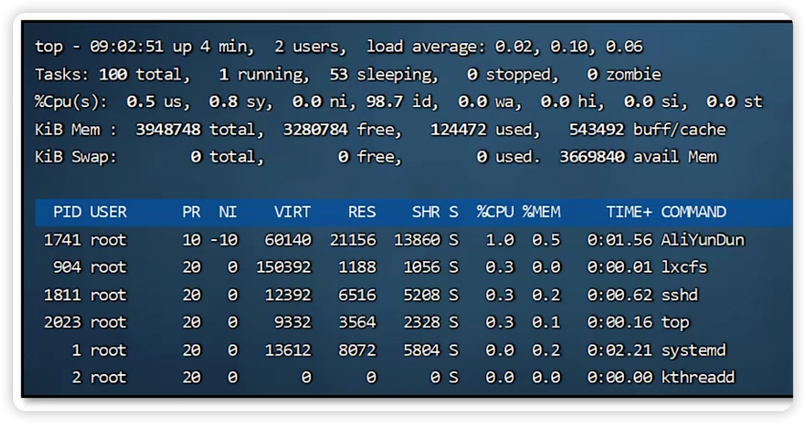


#### VisualVM

VisuaLVM是多功能合一的Java故障排除工具并且他是一款可视化工具，整合了命令行 JDK 工具和轻量级分析功能，功能非常强大。
这款软件在Oracle JDK 6~8 中发布，但是在 Oracle JDK 9 之后不在JDK安装目录下需要单独下载。下载地址：https://visualvm.github.io

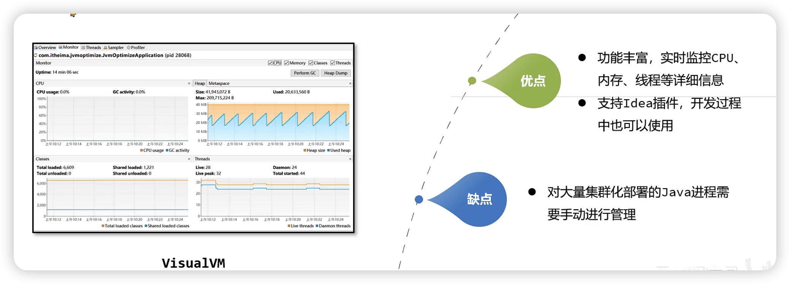


**生产环境禁止使用，一些操作会阻塞用户线程**

> ###### Arthas

Arthas 是一款线上监控诊断产品，通过全局视角实时查看应用 Load、内存、gc、线程的状态信息，并能在不修改应用代码的情况下，对业务问题进行诊断，包括查看方法调用的出入参、异常，监测方法执行耗时，类加载信息等，大大提升线上问题排查效率。


案例：使用arthas tunnel管理所有需要监控的程序

小李的团队已经普及了arthas的使用，但是由于使用了微服务架构，生产环境上的应用数量非常多，使用arthas还得登录到每一台服务器上再去操作非常不方便。他看到官方文档上可以使用tunnel来管理所有需要监控的程序。

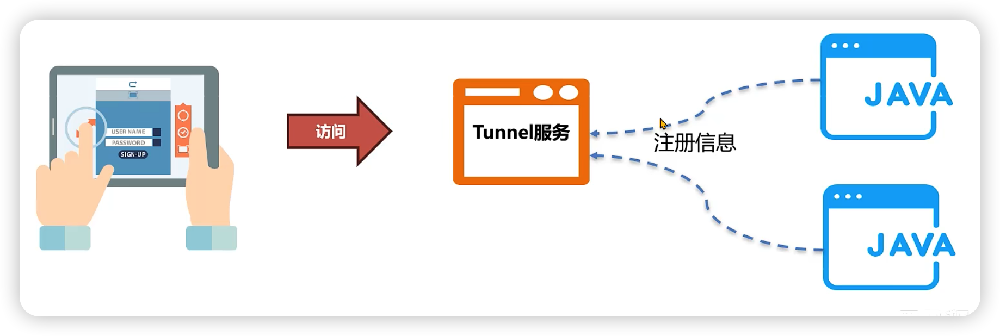

使用：

服务端：需要先启动arthas-tunnel-server-3.7.1.fatjar.jar

```sh
#!/bin/bash

# Set the path of the jar file
JAR_PATH=/root/arthas-tunnel-server/arthas-tunnel-server-3.7.2-fatjar.jar

# Check if the jar file exists
if [ ! -f "$JAR_PATH" ]; then
    echo "Jar file not found at $JAR_PATH"
    exit 1
fi

# Find the running Java process for the jar file
PROCESS_ID=$(/usr/java/openjdk20/jdk-20.0.1/bin/jps -mlv | grep $JAR_PATH | awk '{print $1}')

# Stop the running process if it exists
if [ ! -z "$PROCESS_ID" ]; then
  echo "Stopping process $PROCESS_ID..."
  kill $PROCESS_ID
fi

# Start the Java process
echo "Starting $JAR_PATH..."
nohup java -jar -Dserver.port=8199 -Darthas.enable-detail-pages=true $JAR_PATH  &
```


下面是客户端：

（1）maven依赖

```xml
<!-- https://mvnrepository.com/artifact/com.taobao.arthas/arthas-spring-boot-starter -->
<dependency>
    <groupId>com.taobao.arthas</groupId>
    <artifactId>arthas-spring-boot-starter</artifactId>
    <version>3.7.2</version>
</dependency>

```


（2）配置文件

```yaml
arthas:
  #tunneL她址，目前是部署在同一台服务器，正式坏境需要拆分
  tunnel-server: ws://1ocalhost:7777/ws
  #tunneL显示的应用名称，直接使用应片名
  app-name: ${spring.application.name}
  #arthas http访问的端口和运程连接的端口
  http-port: 8888
  telnet-port: 9999

```


（3）打开tunnel的服务端页面，查看所有的进程列表，并选择进程进行arthas的操作。


#### Prometheus + Grafana

Prometheus+Grafana是企业中运维常用的监控方案，其中Prometheus用来采集系统或者应用的相关数据，同时具备告警功能。Grafana可以将Prometheus采集到的数据以可视化的方式进行展示。

Java程序员要学会如何读懂Grafana展示的Java虚拟机相关的参数。


需要：spring-boot-starter-actuator、MicroMeter ，上面的依赖关于在项目会提供监控结果接口访问


通过接口收集，然后通过监控大盘查看

#### heapHero.io


#### 诊断原因和解决方法

通过分析工具诊断问题的产生原因，定位到出现问题的源代码

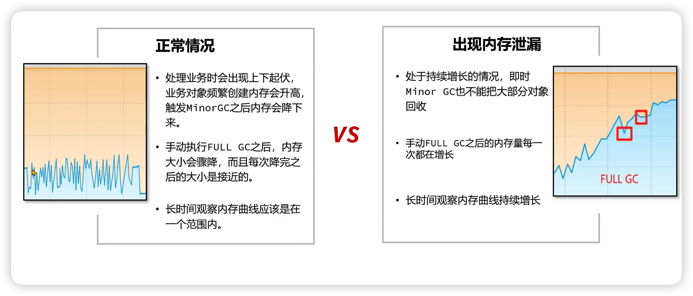

举例内存溢出原因

（1）equals和hashCode，没有正确重写，体现在Map等容器类

对象如果没有重写HashCode会随机生成数。

（2）内部类引用外部类

非静态内部类案例

```java
//B为非静态内部类
new A().new B();
//解决，更改B为静态内部类即可
new A.B();

```

匿名内部类案例

匿名内部类，创建时，内部类会引用调用方this

```java
package com.example.arthastunnelserver;

import java.util.ArrayList;
import java.util.List;

public class Outer {
    private byte[] bytes=new byte［1024];
  // 改static方法即可
    public List<String> newList(){
        List<String>list=new ArrayList<String>() {{
            add("1");
            add("2");
        }};
        return list;
    }

    public static void main(String[] args) {
        int count = 0;
        ArrayList<Object> objects = new ArrayList<>();

        while (true){
            System.out.println(++count);
            objects.add(new Outer().newList());
        }
    }
}

```

（3）ThreadLocal

线程池没有remove

（4）String.intern()

JDK6中字符串常量池位于堆内存中的Perm Gen永久代中，如果不同字符串的intern方法被大量调用，字符串常量池会不停的变大超过永久代内存上限之后就会产生内存溢出问题。

（5）静态字段保存对象

如果大量的数据在静态变量中被长期引用，数据就不会被释放，如果这些数据不再使用，就成为了内存泄漏。


解决：使用懒加载

（6）资源没有正确关闭

连接和流这些资源会占用内存，如果使用完之后没有关闭，这部分内存不一定会出现内存泄漏，但是会

导致close方法不被执行。

解决方案：

1、为了防止出现这类的资源对象泄漏问题，必须在finally块中关闭不再使用的资源。

2、从 Java 7 开始，使用try-with-resources语法可以用于自动关闭资源。


（7） 并发请求问题

本地模拟：jmeter

请求多，请求时间长，获取对象比较多（保留大量内存数据到内存中）

#### 定位问题方案

##### 生成内存快照分析

优点：通过完整的內存快照准确地判断出问题产生的原因

缺点：
内存较大时，生成内存快照较慢，会停止用户线程

通过MAT分析内存快照，至少要准备1.5 - 2倍大小的内存空间


##### 在线定位问题 arthas/btrace


优点：无需生成内存快照，整个过程对用户的影响较小
缺点：

无法查看到详细的内存信息

需要通过arthas或者btrace工具调测

发现问题产生的原因，需要具备一定的经验


> btrace


BTrace 是一个在Java 平台上执行的追踪工具，可以有效地用于线上运行系统的方法追踪，具有侵入性小、对性
能的影响微乎其微等特点。
项目中可以使用btrace工具，打印出方法被调用的栈信息。
使用方法：
1、下载btrace工具，官方地址：https://github.com/btraceio/btrace/release/latest

2、编写btrace脚本，通常是一个java文件

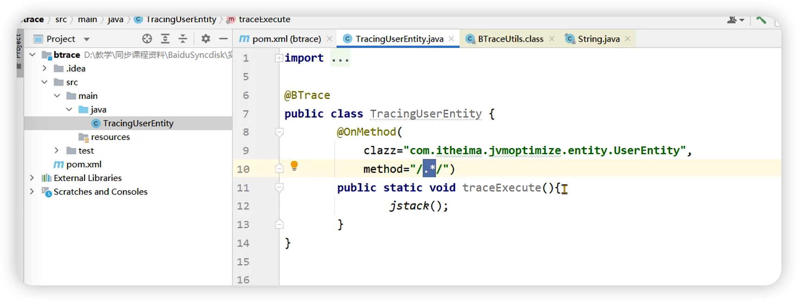


3、将btrace工具和脚本上传到服务器，在服务器上运行 btrace 进程ID 脚本文件名

4、观察执行结果。


>  步骤


1、使用jmap -histo: live 进程ID > 文件名 命令将内存中存活对象以直方图的形式保存到文件中，这个过程会影响用户的时间，但是时间比较短暂。
2、分析内存占用最多的对象，一般这些对象就是造成内存泄漏的原因。

3、使用arthas的stack命令，追踪对象创建的方法被调用的调用路径，找到对象创建的根源。也可以使用btrace工具编写脚本追踪方法执行的过程。

```shell
# arthas 查看对象创建的调用堆栈
stack 类名 -n 2
# bt
btrace 进程ID 脚本文件名

```


#### 


### 使用MAT工具诊断内存

```shell
# 发生OOM，dump -》hprof内存快照
-XX:+HeapDumpOnOutOfMemoryError
-XX:+HeapDumpPath=<path>.hporf
# FullGC之前生成对内存快照
-XX:+HeapDumpBeforeFUllGC
```


MAT内存快照，内存泄露检测报告


> 内存检测原理

- MAT提供了称为支配树 （Dominator Tree）的对象图。支配树展示的是对象实例间的支配关系。在对象引用图中，所有指向对象B的路径都经过对象A，则认为对象A支配对象B。

- MAT就是根据支配树，从叶子节点向根节点遍历，如果发现深堆的大小超过整个堆内存的一定比例國值，就会将其标记成内存泄漏的“嫌疑对象〞。


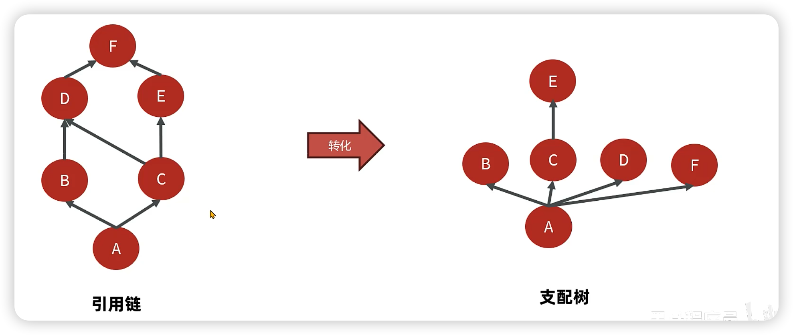


支配树中对象本身占用的空间称之为浅堆（Shallow Heap）.支配树中对象的子树就是所有被该对象支配的内容，这些内容组成了对象的深堆 （Retained Heap），也称之为保留集（Retained Set）。深堆的大小表示该对象如果可以被回收，能释放多大的内存空间。

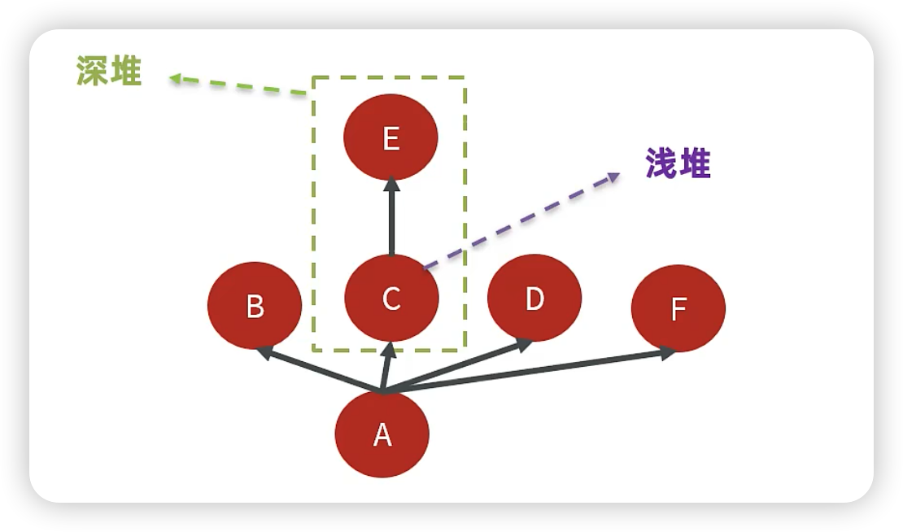

打印用对象的组成和大小

```
  <dependency>
            <groupId>org.openjdk.jol</groupId>
            <artifactId>jol-core</artifactId>
            <version>0.9</version>
        </dependency>
```

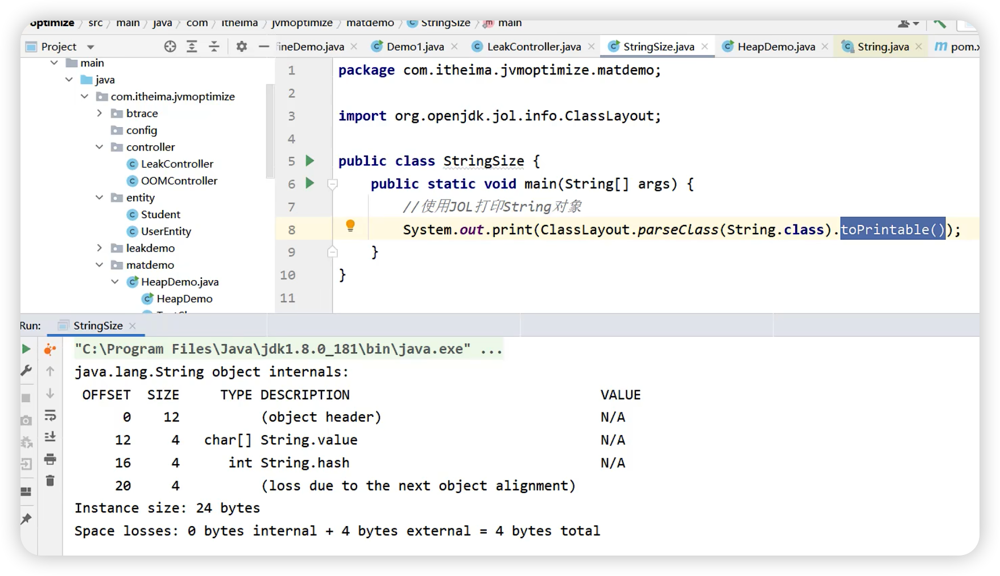

> 导出运行中系统的内存快照并进行分析


- 通过JDK自带的jmap命令导出，格式为：jmap -dump:live,format=b,file=文件路径和文件名进程ID

- 通过arthas的heapdump命令导出，格式为：heapdump --live 文件路径和文件名


> 分析超大堆的内存照


在程序员开发用的机器内存范围之内的快照文件，直接使用MAT打开分析即可。但是经常会遇到服务器上的程序占用的内存达到10G以上，开发机无法正常打开此类内存快照，此时需要下载服务器操作系统对应的MAT。下载地址：https://eclipse.dev/mat/downloads.php
通过MAT中的脚本生成分析报告：

```shell
./ParseHeapDump.sh 快照文件路径 org.eclipse.mat.apisuspects org.eclipse.mat.api:overview org.eclipse.mat.api:top_components
```

注意：默认MAT分析时只使用了1G的堆内存，如果快照文件超过1G，需要修改MAT目录下的
MemoryAnalyzer.ini配置文件调整最大堆内存。


**线上出现OOM内存溢出时，需要增加JVM参数，导出内存快照**

**线上出现OOM内存溢出时，需要增加JVM参数，导出内存快照**

**线上出现OOM内存溢出时，需要增加JVM参数，导出内存快照**


##### 内存溢出案例：Mybatis导致的内存溢出

Mybatis在使用foreach进行sql拼接时，会在内存中创建对象，如果foreach处理的数组或者
集合元素个数过多，会占用大量的内存空间。


##### 内存溢出案例：导出大文件Excel

使用hutools-BigExcelWriter

esayexcel

##### 内存溢出案例 ThreadLocal使用时占用大量内存

很多微服务会选择在拦截器preHandle方法中去解析请求头中的数据，并放入一些数据到ThreadLocal中方便后续使用。在拦截器的afterCompletion方法中，必须要将ThreadLocal中的数据清理掉。

##### 内存溢出案例 ：文章审核

使用MQ，队列

##### 

## GC调优

GC调优指的是对垃圾回收(Garbage Collection)进行调优。GC调优的主要目标是避免由垃圾回收

引起程序性能下降。

GC调优的核心分成三部分:

1、通用JVM参数的设置。

2、特定垃圾回收器的JVM参数的设置

3、解决由频繁的FULLGC引起的程序性能问题


### GC调优核心指标

#### 1、吞吐量(Throughput)

吞吐量分为业务吞吐量和垃圾回收吞吐量

业务吞吐量指的在一段时间内，程序需要完成的业务数量。比如企业中对于吞吐量的要求可能

会是这样的:

- 支持用户每天生成10000笔订单
- 在晚上8点到10点，支持用户查询50000条商品信息


保证高吞吐量的常规手段有两条:

- 优化业务执行性能，减少单次业务的执行时间
- 优化垃圾回收吞吐量

#### 2、延迟

延迟指的是从用户发起一个请求到收到响应这其中经历的时间

- 所有的请求必须在5秒内返回给用户结果

- 延迟 = GC延迟 + 业务执行时间


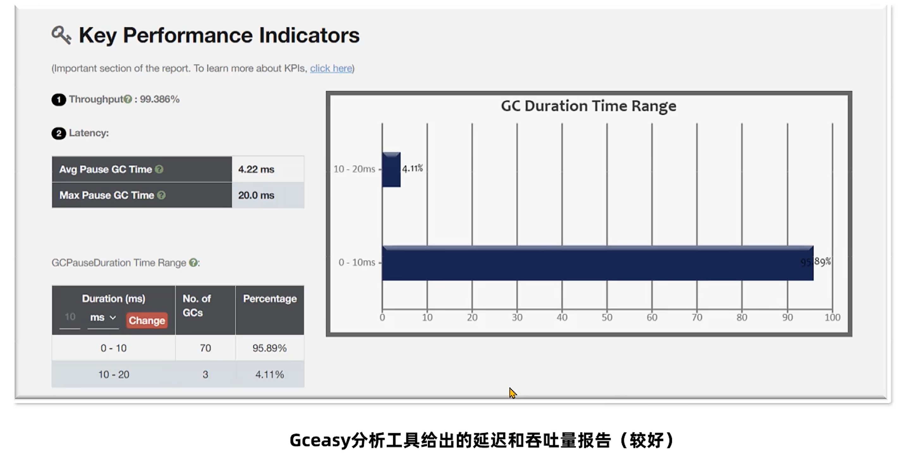


#### 3、内存使用量

指Java应用占用系统内存的最大值，越小越好


### GC调优方法

#### 发现问题

> 调优步骤

1. 发现问题： 通过监控工具尽可能早地发现GC时间过长、频率过高的现象
2. 诊断问题：通过分析工具，诊断问题的产生原因
3. 修复问题： 调整JVM参数或者修复源代码中的问题
4. 测试验证：在测试环境运行之后获得GC数据，验证问题是否解决

##### jstat工具

- jstat工具是JDK自带的一款监控工具，可以提供各种垃圾回收、类加载、编译信息等不同的数据。
- 命令： jstat -gc 进程ID 每次统计的间隔(毫秒) 统计次数


- c 代表capacity容量，U代表Used使用量
- S - 幸存者区，E - 伊园区，0 - 老年代，M - 元空间
- YGC、YGT: 年轻代GC次数和GC耗时 (单位:秒)
- FGC: 次数
- FGCT:耗时
- GCT:  总耗时

##### visual VM

- Visual VM中提供了一款Visual Tool插件，
- 实时监控Java进程的堆内存结构堆内存变化趋势

- 垃圾回收时间的变化趋势。

- 监控对象晋升的直方图


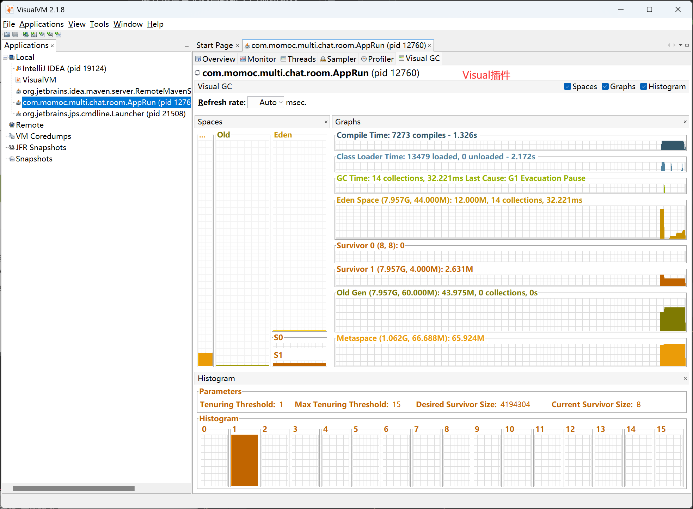

优点: 适合开发使用，能直观的 看到堆内存和GC的变化趋势
缺点: 对程序运行性能有一定影响生产环境程序员一般没有权限进行操作

##### Prometheus + Grafana

前面有简单介绍


#####  GC日志

通过GC日志，可以更好的看到垃圾回收细节上的数据，同时也可以根据每款垃圾回收器的不同特点更好地发现存在的问题

```shell
# JDK 8及以下
-XX:+PrintGCDetails -Xloggc:文件名
# JDK9及之后
-Xlog:gc*:file=文件名
```


> 使用GC View将GC日志转换成可视化图表

https://github.com/chewiebug/GCViewer

使用方法:

``` sh
java -jar gcviewer-1.36.jar E:\devTools\vmlog\chatmvlog.log.2
```

如

```log
[0.004s][info][gc,init] CardTable entry size: 512
[0.004s][info][gc     ] Using G1
[0.005s][info][gc,init] Version: 20.0.1+9-29 (release)
[0.005s][info][gc,init] CPUs: 20 total, 20 available
[0.005s][info][gc,init] Memory: 32581M
[0.005s][info][gc,init] Large Page Support: Disabled
[0.005s][info][gc,init] NUMA Support: Disabled
[0.005s][info][gc,init] Compressed Oops: Enabled (32-bit)
[0.005s][info][gc,init] Heap Region Size: 1M
[0.005s][info][gc,init] Heap Min Capacity: 8M
[0.005s][info][gc,init] Heap Initial Capacity: 100M
[0.005s][info][gc,init] Heap Max Capacity: 100M
[0.005s][info][gc,init] Pre-touch: Disabled
[0.005s][info][gc,init] Parallel Workers: 15
[0.005s][info][gc,init] Concurrent Workers: 4
[0.005s][info][gc,init] Concurrent Refinement Workers: 15
[0.005s][info][gc,init] Periodic GC: Disabled
[0.005s][info][gc,metaspace] CDS archive(s) mapped at: [0x0000000800000000-0x0000000800c60000-0x0000000800c60000), size 12976128, SharedBaseAddress: 0x0000000800000000, ArchiveRelocationMode: 0.
[0.005s][info][gc,metaspace] Compressed class space mapped at: 0x0000000801000000-0x0000000841000000, reserved size: 1073741824
[0.005s][info][gc,metaspace] Narrow klass base: 0x0000000800000000, Narrow klass shift: 0, Narrow klass range: 0x100000000
[0.240s][info][gc,start    ] GC(0) Pause Young (Normal) (G1 Evacuation Pause)
.....

```


##### GCeasy

**AI机器学习技术**在线进行GC分析和诊断的工具。

定位内存泄漏、GC延迟高的问题，提供JVM参数优化建议，支持在线的可视化工具图表展示。

官方网站: https://gceasy.io/


##### 常见的GC模式

1、正常情况

特点：呈现锯齿状，对象创建之后内存上升，一旦发生垃圾回收之后下降到底部，并且每次下降之后的内存大小
接近，存留的对象较少。

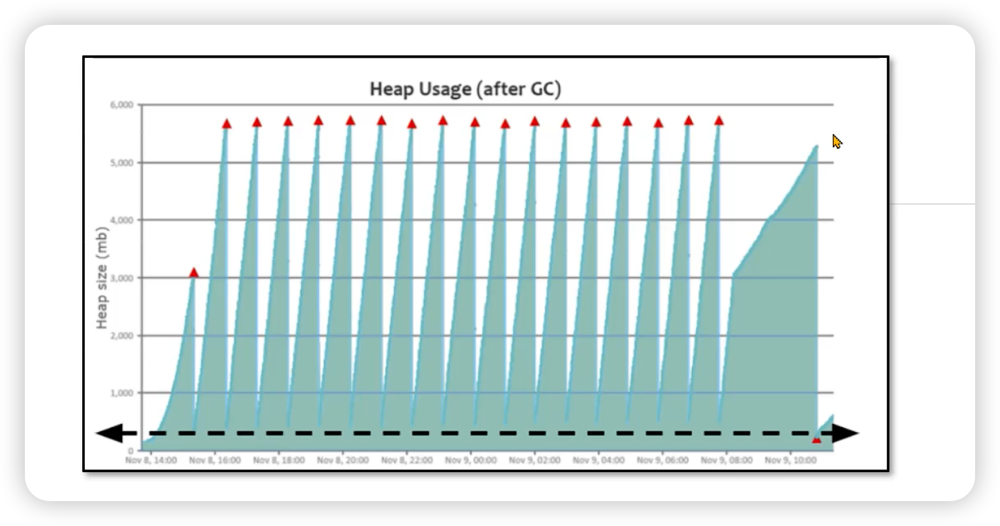

2、缓存对象过多

特点：呈现锯齿状，对象创建之后内存上升，一旦发生垃圾回收之后下降到底部，并且每次下降之后的内存大小

接近，处于比较高的位置。

问题产生原因：

程序中保存了大量的缓存对象，导致GC之后无法释放，可以使用MAT或者HeapHero等工具进行

分析内存占用的原因。

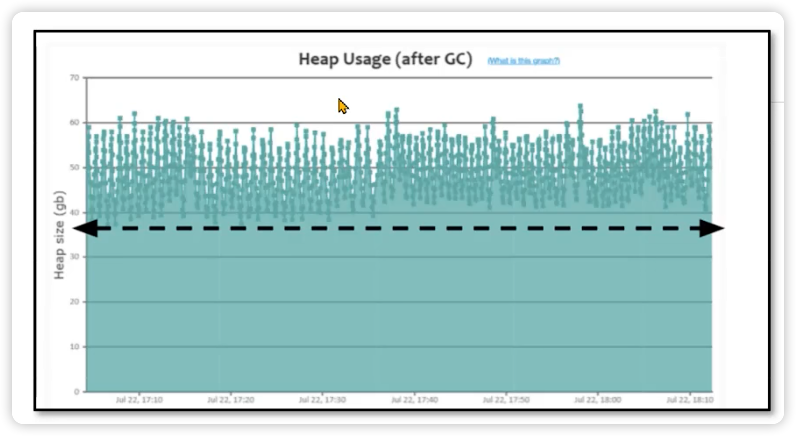

3、内存泄露

特点：呈现锯齿状，每次垃圾回收之后下降到的内存位置越来越高，最后由于垃圾回收无法释放空间导致对象无法分配产生OutofMemory的错误。
问题产生原因：程序中保存了大量的内存泄漏对象，导致GC之后无法释放，可以使用MAT或者HeapHero等工具
进行分析是哪些对象产生了内存泄漏。

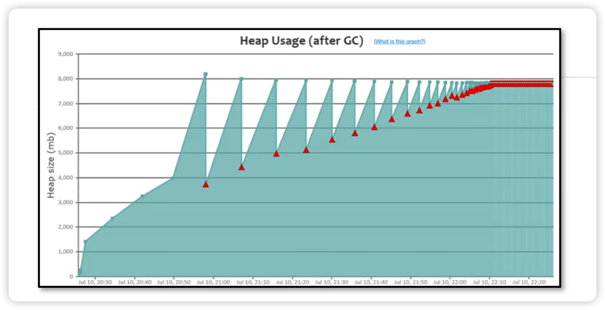

4、持续的FullGC

特点：在某个时间点产生多次FuL1 GC，CPu使用率同时飙高，用户请求基本无法处理。一段时间之后恢复正常。
问题产生原因：在该时间范围请求量激增，程序开始生成更多对象，同时垃圾收集无法跟上对象创建速率，导致
持续地在进行FULL GC。

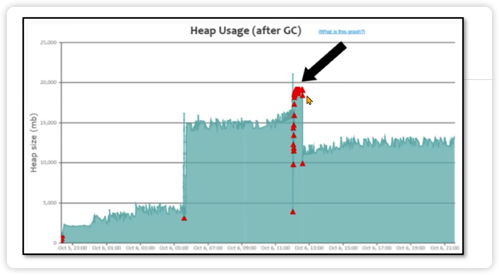

5、元空间不足导致的FullGC

特点：堆内存的大小并不是特别大，但是持续发生FULLGC。
问题产生原因： 元空间大小不足，导致持续FULLGC回收元空间的数据。GC分析报告


#### 解决GC问题的手段


##### （1）优化基础JVM参数

基础JVM参数的设置不当，会导致频繁FULLGC的产生


> 所有JVM虚拟机参数

https://docs.oracle.com/javase/8/docs/technotes/tools/unix/java.html#BGBCIEFC


> 参数1：- Xmx 和 -Xms

-Xmx参数设置的是最大堆内存，但是由于程序是运行在服务器或者容器上，计算可用内存时，要将元空间、操作

系统、其它软件占用的内存排除掉。

案例：服务器内存4G，操作系统+元空间最大值+其它软件占用1.5G，-Xmx可以设置为2g。

最合理的设置方式应该是根据**最大并发量估算服务器**的配置，然后再根据服务器配置计算最大堆内存的值。


-Xms用来设置初始堆大小，**建议将-Xms设置的和-Xmx一样大**，有以下几点好处：

- 运行时性能更好，堆的扩容是需要向操作系统申请内存的，这样会导致程序性能短期下降。

- 可用性问题，如果在扩容时其他程序正在使用大量内存，很容易因为操作系统内存不足分配失败。
- 启动速度更快，Oracle官方文档的原话：如果初始堆太小，Java 应用程序启动会变得很慢，因为 JVM 被迫频繁执行垃圾收集，直到堆增长到更合理的大小。为了获得最佳启动性能，请将初始堆大小设置为与最大堆大小相同。

> 参数2： -XX: MaxMetaspaceSize  -XX:MetaspaceSize

MAX参数指的是最大元空间大小，默认值比较大，如果出现元空间内存泄漏会让操作系统可用内存不可控，建议根据测试情况设置最大值，一般设置为256m。

-XX：Metaspacesize=值 指：**达到该值之后会触发FULLGC**（网上很多文章的初始元空间大小是错误的），后续什么时候再触发JVM会自行计算。如果设置为和MaxMetaspacesize一样大，就不会FULLGC，但是对象也无法
回收。


> 参数3：-Xss虚拟机栈大小

- 语法：-Xss栈大小或-XX:ThreadStackSzie=1024
- 单位：字节（默认，必须是 1024 的倍数）、K或者K（KB）、m或者M（MB）、g或者G（GB）


> 参数4：不建议手动设置的参数

由于JVM底层设计极为复杂，一个参数的调整也许让某个接口得益，但同样有可能影响其他更多接口。

- -Xmn 年轻代的大小，默认值为整个堆的1/3，可以根据峰值流量计算最大的年轻代大小，尽量让对象只存放在年轻代，不进入老年代。但是实际的场景中，接口的响应时间、创建对象的大小、程序内部还会有一些定时任务等不确定因素都会导致这个值的大小并不能仅凭计算得出，如果设置该值要进行大量的测试。G1垃圾回收器尽量不要设置该值，G1会动态调整年轻代的大小。

- -XX：SurvivorRatio 伊甸园区和幸存者区的大小比例，默认值为8。
- -XX:MaxTenuringThreshold 最大晋升國值，年龄大于此值之后，会进入老年代。
- 另外JVM有动态年龄判断机制：将年龄从小到大的对象占据的空间加起来，如果大于survivor区域的50%，然后把等于或大于该年龄的对象,放入到老年代。

> 其他参数

- -XX：+DisableExplicitGC 禁止在代码中使用System.gc()，System.gc()可能会引起FULLGC，在代码中尽量不要使用。使用DisableExplicitGc参数可以禁止使用System.gc()方法调用。

- -XX：+HeapDumpOnoutofMemoryError：发生OutofMemoryError错误时，自动生成hprof内存快照文件。
- -XX：HeapDumpPath=<path>：指定hprof文件的输出路径。
- 打印GC日志
    - JDK8及之前：-XX：+PrintGCDetails -xX：+PrintGCDatestamps-XLoggc：文件路径
    - JDK9及之后：-xlog：gc*：file=文件路径


> JVM参数模板


```sh
-Xmslg
-Xmxlg
-Xss256k
-XX: MaxMetaspaceSize=512m
-XX:+DisableExplicitGC
-XX:+HeapDumpOnouto fMemoryError
-XX:HeapDumpPath=/opt/Logs /my-service.hprof
-XX:+PrintGCDetails
-XX:+PrintGCDateStamps
-Xloggc：文件路径
```

注意：
JDK9及之后gc日志输出修改为 -XLog:gc*：file=文件名 堆内存大小和栈内存大小根据实际情况灵活调整。


##### （2）减少对象产生

大多数场景下的FULLGC是由于对象产生速度过快导致的，减少对象产生可以有效的缓解FULLGC的发生

##### （3）更换垃圾回收器

选择适合当前业务场景的垃圾回收器，减少延迟、提高吞吐量

> 案例

垃圾回收器的选择
背景：小李负责的程序在高峰期遇到了性能瓶颈，团队从业务代码入手优化了多次也取得了不错的效
果，这次他希望能采用更合理的垃圾回收器优化性能。

思路：

1、编写Jmeter脚本对程序进行压测，同时添加RT响应时间、每秒钟的事务数等指标进行监控。

2、选择不同的垃圾回收器进行测试，并发量分别设置50、 100、 200，观察数据的变化情况。

3、组合测试

- JDK8 下 ParNew + CMS组合：-XX：+UseParNewGC -XX：+UseConcMarkSweepGC

- 默认组合：PS + PO
- JDK8使用G1：-XX：+ UseG1GC
- JDK11 默认G1

机器参数设置：-Xms8g -xss256k. -XX: MetaspaceSize=512m -XX: +DisableExplicaitGC

- ps + po 50并发：260ms 100 并发：474ms 200并发：930ms
- cms  50：157ms  200并发：833ms
- G1 JDK11 200：248ms


##### （4）优化垃圾回收器参数


GC调优没有没有唯一的标准答案

如何调优与硬件、程序本身、使用情况均有关系，重点学习调优的工具和方法


> CMS优化案例

这部分优化效果未必出色，仅当前边的一些手动无效时才考虑。

**CMS的并发模式失败（concurrent mode failure） 现象**

由于CMS的垃圾清理线程和用户线程是并行进行的，如果在并发清理的过程中老年代的空间不足以容纳放入老年代的对象，会产生并发模式失败。并发模式失败会导致Java虚拟机使用**Serial o1d单线程**进行FULLGc回收老年代，出现长时间的停顿。

解决方案：
1.减少对象的产生以及对象的晋升。

2.增加堆内存大小

3.优化垃圾回收器的参数，比如-XX：CMSInitiatingOccupancyFraction=值，当**老年代大小到达该阈值时**，会自动进行CMS垃圾回收，通过控制这个参数提前进行老年代的垃圾回收，减少其大小。

JDK8中默认这个参数值为-1，根据其他几个参数计算出阈值：

（（100 - MinHeapFreeRatio） + （double）（CMSTriggerRatio * MinHeapFreeRatio） ～ 100.0）

该参数设置完是不会生效的，必须开启-XX：+UseCMSInitiatingOccupancyOnly参数。


优化垃圾回收器参数

优化垃圾回收器的参数，能在一定程度上提升GC效率


### 案例实战


背景：小李负责的程序在高峰期经常会出现接口调用时间特别长的现象，他希望能优化程序的性能。
思路：

1、生成GC报告，通过Gceasy工具进行分析，判断是否存在GC问题或者内存问题。

2、存在内存问题，通过jmap或者arthas将堆内存快照保存下来。

3、通过MAT或者在线的heaphero工具分析内存问题的原因。

4、修复问题，并发布上线进行测试。


有大量对象不再GC ROOT引用链上


### 性能调优

##### 性能调优解决的问题

应用程序在运行过程中经常会出现性能问题，比较常见的性能问题现象是：

- 通过top命令查看CPU占用率高，接近100甚至多核CPU下超过100都是有可能的。
- 请求单个服务处理时间特别长，多服务使用skywalking等监控系统来判断是哪一个环节性能低下。
- 程序启动之后运行正常，但是在运行一段时间之后无法处理任何的请求（内存和GC正常）。


##### 性能调优方法


>  线程转储（Thread Dump）

提供了对所有运行中的线程当前状态的快照。线程转储可以通过**jstack、 visualvm**等工具获取。其中包含了**线程名、优先级、线程ID、线程状态、线程栈信息**等等内容，可以用来解决CPu占用率高、死锁等问题。

```shell
# JDK自带
jstack 58457
```


线程转储(Thread Dump)中的几个核心内容

- 名称:线程名称，通过给线程设置合适的名称更容易“见名知意
- 优先级 (prio):  线程的优先级
- Java ID (tid): JVM中线程的唯一ID
- 本地ID(nid):   操作系统分配给线程的唯一ID
- 状态:线程的状态，分为:
    - NEW- 新创建的线程，尚未开始执行
    - RUNNABLE-正在运行或准备执行
    - BLOCKED-等待获取监视器锁以进入或重新进入同步块/方法
    - WAITING-等待其他线程执行特定操作，没有时间限制
    - TIMED_WAITING等待其他线程在指定时间内执行特定操作
    - TERMINATED已完成执行
- 栈追踪:显示整个方法的栈恢信息
- 线程转储的可视化在线分析平台!
    - https://istackreview
    - https://fastthread.io


##### 案例1：CPU占用率高问题解决方案

问题:
监控人员通过prometheus的告警发现CPU占用率一直处于很高的情况，通过top命令看到是由于Java程序引起的，希望能快速定位到是哪一部分代码导致了性能问题


1、top -p

```
# 查看进程里面的线程，进入后按H
top-p 进程ID
```


2、摁H，查看线程ID


3、保存线程调用栈信息

```shell
jstack 2668064 > test.dump
```


4、找到nid线程ID相同的栈信息，需要将之前记录下的十进制线程号转换成16进制
通过打印%x\n‘线程ID命令直接获得16进制下的线程ID

```shell
# 转换成线程nid
printf '%x\n' 2668064 
```

遗留问题:如果方法中嵌套方法比较多，如何确定栈信息中哪一个方法性能较差?

注意：在定位CPU占用率高的问题时，比较需要关注的是状态为RUNNABLE的线程。但实际上，有一些线程执行本地方法时并不会消耗CPU，而只是在等待。但JVM 仍然会将它们标识成“RUNNABLE”状态。


##### 案例2: 接口响应时间很长的问题

问题:在程序运行过程中，发现有几个接口的响应时间特别长，需要快速定位到是哪一个方法的代码执行过程中出现了性能问题。

解决思路:
已经确定是某个接口性能出现了问题，但是由于方法嵌套比较深，需要借助于arthas定位到具体的方法。


###### Arthas 的 trace命令

使用arthas的trace命令，可以展示出整个方法的调用路径以及每一个方法的执行耗时

命令: trace 类名 方法名

- 添加 --skipJDKMethod false 参数可以输出JDK核心包中的方法及耗时
- 添加“#cost >毫秒值’ 参数，只会显示耗时超过该毫秒值的调用
- 添加-n 数值参数，最多显示该数值条数的数据
- 所有监控都结束之后，输入stop结束监控，重置arthas增强的对象

```shell
trace 全类名路径 -a -skipJDKMethod  false'#cost > 1000' -n 1
```


###### Arthas的watch命令

在使用trace定位到性能较低的方法之后，使用watch命令监控该方法，可以获得更为详细的方法信息。
命令: watch 类名 方法名 ' {params， returnobj} ' #cost>毫秒值' -x 2

-  {params，returnobj} 代表打印参数和返回值
- -x 代表打印的结果中如果有嵌套(比如对象里有属性)，最多只展开2层。允许设置的最大值为4
- 所有监控都结束之后，输入stop结束监控，重置arthas增强的对象


##### 案例3： 定位偏底层的性能问题

问题:有一个接口中使用了for循环向ArrayList中添加数据，但是最终发现执行时间比较长，需要定位是由于什么原因导致的性能低下。

解决思路:  Arthas提供了性能火焰图的功能，可以非常直观地显示所有方法中哪些方法执行时间比较长

###### Arthas的profile命令,生成性能监控的火焰图

命令1: profiler start 开始监控方法执行性能
命令2: profiler stop --format html 以HTML的方式生成火焰图

火焰图中一般找绿色部分Java中栈顶上比较平的部分，很可能就是性能的瓶颈

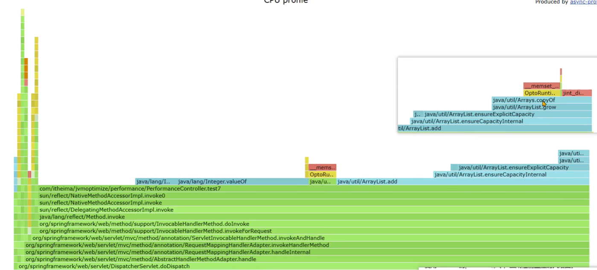

##### 案例4: 线程被耗尽问题

问题:

程序在启动运行一段时间之后，就无法接受任何请求了。将程序重启之后继续运行，依然会出
现相同的情况。
解决思路:
线程耗尽问题，一般是由于执行时间过长，分析方法分成两步

- 1、检测是否有死锁产生，无法自动解除的死锁会将线程永远阻塞
- 2、如果没有死锁，再使用案例1的打印线程栈的方法检测线程正在执行哪个方法，一般这些大量出现的方法就是慢方法

死锁:两个或以上的线程因为争夺资源而造成互相等待的现象


定位方式：

###### 1、jstack -l 进程ID > 文件名

将栈保存到本地

搜索deadlock

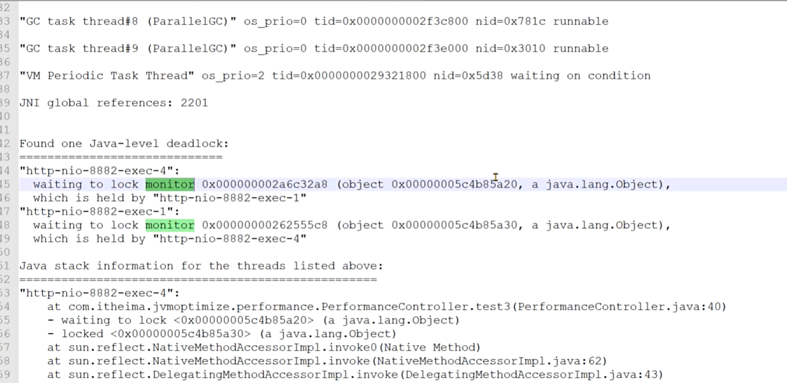

###### 2、开发环境中使用visual vm或者Jconsole工具

可以检测出死锁。使用线程快照生成工具
就可以看到死锁的根源。生产环境的服务一般不会允许使用这两种工具连接


###### 3、fastthread

使用fastthread自动检测线程问题。https://fastthread.io
Fastthread 和 Gceasy类似，是一款在线的自动线程问题检测工具，可以提供线程分析报告
通过报告查看是否存在死锁问题


> JIT对程序性能的影响

Java程序在运行过程中，JIT即时编译器会实时对代码进行性能优化，所以仅凭少量的测试是无法真实反应运行系统最终给用户提供的性能。如下图，随着执行次数的增加，程序性能会逐渐优化。


##### JMH的使用

> 正确地测试代码性能

OpenJDK 中提供了一款叫JMH的工具，可以准确地对Java(Java Microbenchmark Harness) 量化方法的执行性能官网地址: https://github.com/openjdk/jmh

会首先执行预热过程，确果。正的迭代测试，最后输出测试的结JIT对代码进行优化之后再进行真的迭代测试，最后输出测试结果


（1）创建maven项目，自动生成代码与目标自行更改jmh版本，目前是1.37版本

```sh
mvn archetype:generate  -DinteractiveMode=false  -DarchetypeGroupId=org.openjdk.jmh   -DarchetypeArtifactId=jmh-java-benchmark-archetype  -DgroupId=org.sample   -DartifactId=test   -Dversion=1.0
```

(2) 编写示例

```java
package org.sample;

import org.openjdk.jmh.annotations.*;

import java.util.concurrent.TimeUnit;


//预热次数 时间
@Warmup(iterations = 5, time = 1)
//启动多少进程,和启动参数
@Fork(value = 1, jvmArgs = {"-Xms1g", "-Xmx1g"})
//指定显示结果
@BenchmarkMode(Mode.AverageTime)
//指定显示结果单位
@OutputTimeUnit(TimeUnit.NANOSECONDS)
//变量共享范围
@State(Scope.Benchmark)
public class MyBenchmark {

    @Benchmark
    public void testMethod() {
        // place your benchmarked code here

        int i =0;
        i++;
        return;
    }
    //直接启动，但是有缺点，无法拿到注解变量
    public static void main(String[] args) throws RunnerException {

        Options build = new OptionsBuilder()
                .include(MyBenchmark.class.getSimpleName())
                .forks(1)
                .build();
        new Runner(build).run();
    }

}


```


编写测试方法，几个需要注意的点:

- 死代码问题
- 黑洞的用法


```java
    //黑洞问题解决方案
	@Benchmark
    public void testMethod(Blackhole bh) {
        // place your benchmarked code here

        int i =0;
        i++;
        //黑洞消费，避免死代码产生
        bh.consume(i);
    }
```


通过maven的verify命令，检测代码问题并打包成jar包。通过java -jar target/benchmarks.jar 命令执行基准测试,

测试结果通过https://jmh.morethan.io/生成可视化的结果。

> 案例：日期格式化方法性能测试

在JDK8中，可以使用Date进行日期的格式化，也可以使用LocalDateTime进行格式化，使用JMH对比这两种格式化的性


1、Date对象使用的SimpleDateFormatter是线程不安全的，所以每次需要重新创建对象或者将对象放入ThreadLocal中进行保存。其中每次重新创建对象性能比较差，将对象放入ThreadLocal之后性能相对还是比较好的。

2、LocalDateTime对象使用的DateTimeFormatter线程安全，并且性能较好，如果能将
DateTimeFormatter对象保存下来，性能可以得到进一步的提升

结论：


```java
//预热次数 时间
@Warmup(iterations = 5, time = 1)
//启动多少进程,和启动参数
@Fork(value = 1, jvmArgs = {"-Xms1g", "-Xmx1g"})
//指定显示结果
@BenchmarkMode(Mode.AverageTime)
//指定显示结果单位
@OutputTimeUnit(TimeUnit.NANOSECONDS)
//变量共享范围
@State(Scope.Benchmark)
public class DateBenchmark {

    private static String format = "yyyy-MMdd HH:mm:ss";

    private Date date =new Date();

    private LocalDateTime localDateTime = LocalDateTime.now();

    @Benchmark
    public void testDate(Blackhole blackhole){
        String format1 = threadLocal.get().format(date);

        blackhole.consume(format1);
    }

    @Benchmark
    public void testLocalDateTime(Blackhole blackhole){
        String format1 = localDateTime.format(DateTimeFormatter.ofPattern(format));
        blackhole.consume(format1);
    }

    public static ThreadLocal<SimpleDateFormat> threadLocal = new ThreadLocal<SimpleDateFormat>(){
        @Override
        protected SimpleDateFormat initialValue() {
            return new SimpleDateFormat(format);
        }
    };


    public static ThreadLocal<DateTimeFormatter> dateTimeFormatterThreadLocal = new ThreadLocal<DateTimeFormatter>(){
        @Override
        protected DateTimeFormatter initialValue() {
            return DateTimeFormatter.ofPattern(format);
        }
    };

    @Benchmark
    public void testThreadLocalDate(Blackhole blackhole){
        String format1 = threadLocal.get().format(date);

        blackhole.consume(format1);
    }

    @Benchmark
    public void testThreadLocalLocalDateTime(Blackhole blackhole){
        String format1 = localDateTime.format(dateTimeFormatterThreadLocal.get());
        blackhole.consume(format1);
    }


    public static void main(String[] args) throws RunnerException {
        Options build = new OptionsBuilder()
                .include(DateBenchmark.class.getSimpleName())
                .forks(1)
                .resultFormat(ResultFormatType.JSON)
                .build();
        new Runner(build).run();
    }
}
```


##### 实战案例：性能调优综合实战

问题:
小李的项目中有一个获取用户信息的接口性能比较差，他希望能对这个接口在代码中
进行彻底的优化，提升性能。
解决思路:
1、使用trace分析性能瓶颈
2、优化代码，反复使用trace测试性能提升的情况
3、使用JMH在SpringBoot环境中进行测试。
4、比对测试结果


总结：

1、本案例中性能问题产生的原因是两层for循环导致的循环次数过多，处理时间在循
环次数变大的情况下变得非常长，考虑将一层循环拆出去，创建HashMap用来查询
提升性能。
2、使用LocalDateTime替代SimpleDateFormat进行日期的格式化
3、使用stream流改造代码，这一步可能会导致性能下降，主要是为了第四次优化准
4、使用并行流利用多核C

##### 面试题

你是如何判断一个方法需要耗时多少时间的?


回复：我会在方法上打印开始时间和结束时间，他们的差值就是方法的执行耗时。手动通过postman或者jmeter发起一笔请求，在控制台上看输出的时间。

解答：这样做是不准确的，第一测试时有些对象创建是懒加载的，所以会影响第一次的请求时间，第二因为虚拟机中JIT即时编译器会优化你的代码，所以你这个测试得出的时间并不一定是最终用户处理的时间。


走完上面案例得出结论：

我们使用了OpenJDK中的jmh基准测试框架对某些特定的方法比如加密算法进行基准测试，jmh
可以完全模拟运行环境中的Java虚拟机参数，同时支持预热能通过JIT执行优化后的代码获得更为准确的数据。


1、岗位的主要工作内容

2、岗位发展空间

3、领导期待

4、入准

5、部门架构和团队

6、项目进展和技术路线
