---
# 一、为什么使用索引
索引是存储引擎用于快速找到数据记录的一种数据结构，就好比一本书的目录部分，通过目录找到对应文章的页码，便可以快速定位到需要的文章。MySQL中也是一样的道理，进行数据查找时，首先查看查询条件是否命中某条索引，符合则通过索引查找相关数据，如果不符合则需要全表扫描，即需要一条条的查找记录，直到找到与条件符合的记录。

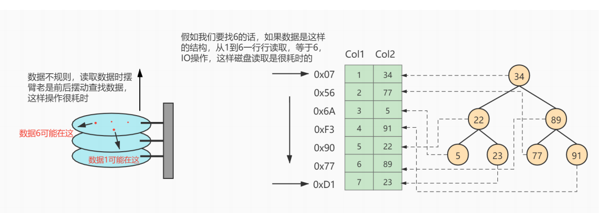

假如给数据使用 二叉树 这样的数据结构进行存储，如下图所示


对字段 Col2 添加了索引，就相当于在硬盘上为 Col2 维护了一个索引的数据结构，即这个 `二叉搜索树`。二叉搜索树的每个节点存储的是 `K,V` 结构数据，Key 是 Col2，value是该key 所在行的文件指针(地址)。比如: 该二叉搜索树的根节点是: 34,0x07。现在对 Col2 添加了索引，这时再去查找 Col2 = 89 这条记录的时候会先去查找该二叉搜索树(二叉树的遍历查找)。读 34 到内存，89 > 34， 继续找右侧数据，读到 89 到内存中， 89 == 89，找到数据之后就根据当前节点的value 快速定位到要查找的记录对应的地址。

这就是我们为什么要创建索引，目的就是为了减少磁盘IO的次数，加快查询速率。

# 二、索引概述
MySQL 官方对索引的定义为：索引(index)是帮助MySQL高效获取数据的数据结构。

索引是数据结构，简单理解为`排好序的快速查找的数据结构`，满足特定查找算法。

这些数据结构以某种方式指向数据，这样就可以在这些数据结构的基础上实现高级查找算法。

索引是在存储引擎中实现的，因此每种存储引擎的索引不一定完全性相同，并且每种存储引擎不一定支持所有索引类型。同时，存储引擎可以定义每个表的 `最大索引数` 和 `最大索引长度`。所有存储引擎支持每个表至少 16 个索引，总索引长度至少为 256 字节。有些存储疫情支持更多的索引数和更大的索引长度。

# 三、索引的优点
1. 索引类似大学图书馆建书目录，提高数据检索的效率，降低 `数据库的ID成本`，这也是创建索引的主要原因。
2. 通过创建唯一索引，可以保证数据库表中每一行数据的唯一性。
3. 在实现数据的参考完整性方面，可以加速表和表之间的连接。换句话说，对于有依赖关系的字表和父表联合查询时，可以提高查询速度。
4. 在使用分组和排序子句进行数据查询时，可以显著减少查询中分组和排序的时间，降低了CPU的消耗。

# 四、索引的缺点
1. 创建索引和维护索引需要耗费时间，并且随着数据量的增加，所耗费的时间也会增加。
2. 索引需要占磁盘空间，除了数据表占数据空间外，每个索引还要占一定的物理空间，存储在磁盘上，如果有大量的索引，索引文件就可能比数据文件更快达到最大文件限制。
3. 虽然索引大大提高了查询速度，但是会降低更新表的速度。当对表中的数据进行增加、删除、修改的时候，索引也要动态的维护，这样就降低了数据的维护速度。

# 五、InnoDB 中索引的推演

## 5.1 索引之前的查找
先看一个精确匹配的例子
```mysql
mysql> select name from user where id = 10;
```
### 1.在一个页中的查找
假设目前表中的记录比较少，所有的记录都可以被存放到一个页中，在查找记录的时候可以根据搜索条件的不同分为两种情况：
1. 以主键为搜索条件
    可以在页目录中使用 **二分法** 快速定位到对应的槽，然后再遍历该槽对应分组中的记录即可快速找到指定的记录。
2. 以其他列作为搜索条件
    因为在数据页中没有对非主键列建立所谓的页目录，所以我们无法通过二分法快速定位相应的槽。这种情况下只能从最小记录开始一次遍历单链表中的每条记录，然后对比每条记录是不是复合搜索条件。很显然，这种查找的效率是非常低效的。
### 2.在很多页中查找
在很多页中查找记录可以分为两个步骤：
1. 定位到记录所在的页。
2. 从所在的页中查找相应的记录。

在没有索引的情况下，不论是根据主键列或者其他列的值进行查找，由于我们并不能快速的定位到记录所在的页，所以只能**从第一个页**沿着**双向链表**一直往下找，在每一个页中根据我们上面的查找方式去查找指定的记录。因为要遍历所有的数据页，所以这种方式显然是 超级耗时的，如果一个表有一亿条记录呢？此时索引应运而生。


## 5.2 设计索引
首先创建一个表
```mysql
mysql> create table index_demo(
        c1 int,
        c2 int,
        c3 char(1),
        primary key (c1)
       ) ROW_FORMAT=compact;
```
这个新建的 index_demo 表，有 2个 int类型的类，1个 char(1)类型的列，而且规定了 c1列为主键，且这个表使用 compact 行格式来记录实际存储记录，这里简化 index_demo 表的行格式示意图


- `record_type`: 记录头信息的一项属性，表示记录的类型，`0`表示普通记录，`2`表示最小记录，`3`表示最大记录，`1`暂时没用过，下面说。
- `next_record`: 记录头信息的一项属性，表示下一条地址相对于本条记录的地址偏移量，我们用箭头来表名下一条记录是谁。
- `各个列的值`: 这里只记录在 index_demo 表中的三个列，分别是 c1、c2和c3.
- `其他信息`: 出了上述3中信息以外的所有信息，包括其他隐藏列的值以及记录的额外信息。

将记录格式示意图的其他信息项暂时去掉并把它竖起来的效果如下


把一些记录放到页里的示意图就是：


### 1.一个简单的索引设计方案
我们在根据某个搜索条件查找一些记录时为什么要遍历所有的数据页呢？因为各个页中的记录并没有规律，我们并不知道我们的搜索条件匹配哪些页中的记录，所以不得不依次遍历所有的数据页。所以如果我们`想快速的定位到需要查找的记录在哪些数据页`中该咋办？我们可以为快速定位记录所在的数据页而`建立一个目录`，建这个目录必须完成下边这些事

- 下一个数据页中用户记录的主键值必须大于上一个页中用户记录的主键值

    假设每个数据页最多能存放3条记录(实际上一个数据页非常大，可以存放下好多记录)。有了这个假设之后我们向 index_demo 表插入3条记录。
    ```msyql
    mysql> insert into index_demo values(1,4,'u'),(3,9.'d'),(5,3,'y');
    ```
   

    从图中可以看出来，index_demo 表中的3条记录都被插入到了编号为10的数据页中了。此时我们再来插入一条记录

    ```mysql
    msyql> insert into index_demo values(4,4,'a');
    ```
    因为页10最多只能放3条记录，所以我们不得不再分配一个新页

    .png)

    注意，新分配的数据页编号可能并部署连续的。它们只是通过维护着上一个页也下一个页的编号而建立了链表关系。另外，页10 中用户记录最大的主键值是5，而 页28 中有一条记录的主键值是4，因为 5>4，所以这就不符合下一个数据页中用户记录的主键值必须大于上一个页中用户记录的主键值的要求，所以在插入主键值为4的记录的时候需要伴随着一次记录移动，也就是把主键值为5的记录移动到页28中，然后再把主键值为4的记录插入到页10中，这个过程的示意图如下:

    

    这个过程表明了在对页中的记录进行增删改操作的过程中，我们必须通过一些诸如记录移动的操作来始终保证这个状态一直成立: 下一个数据页中用户记录的主键值必须大于上一个页中用户记录的主键值。这个过程我们称为页分裂。

- **给所有的页建立一个目录项。**
    由于数据页的编号可能是不连续的，所以在向index_demo表中插入许多条记录后，可能是这样的效果

  

    因为这些 16kb 的页在物理存储上是不连续的，所以如果想要从这么多页中根据主键值快速定位某些记录所在的页，我们需要给他们做个目录，每个页对应一个目录项，每个目录包括下边两个部分:
  - 页的用户记录中最小的主键值，我们用 key 来表示。
  - 页号，我们用 page_no 表示。
    
    所以我们为上边几个页做好的目录就像这样子

    
    
    以 页28 为例，它对应 目录项2，这个目录项中包含着该页的页号28，以及该页中用户记录的最小主键值5.我们只需要把几个目录项所在物理存储器上连续存储(比如: 数组)，就可以实现根据主键值快速查找某条记录的功能了。比如: 查找主键值为20的记录，具体查找过程分两步:
    1. 先通目录项中根据 二分法，快速确定出主键值为 20 的记录在 目录项3 中(因为 12<20<209)，它对应的页是 页9.
    2. 再根据前边说的在页中查找记录的方式去页9中定位具体的记录。
    
    至此，针对数据页做的简易目录就搞定了。这个目录有一个别名，成为索引。

### 2. InnoDB 中的索引方案
#### 2.1 迭代1次: 目录项记录的页
上边称为一个简易的索引方案，是因为我们为了在根据主键值进行查找时使用 二分法 快速定位具体的目录项而 假设 所有目录项都可以在物理存储器上 连续存储，但是这样做有几个问题:
1. InnoDB 是使用页来作为管理存储空间的基本单位，最多保证 16kb 的连续空间，而随着表中记录数量的增多，需要非常大的连续的存储空间才能把所有的目录项都放下，这对记录数量非常多的表是不现实的。
2. 我们时常会对记录进行增删，假设我们把页28中的记录都删除了，那意味着目录项2也就没有存在的必要了，这就需要把目录项2后的目录项都向前移动一下，这样牵一发而动全身的操作效率很差。

所以，我们需要一种可以灵活管理所有目录项的方式。我们发现目录项其实长得跟我们的用户记录差不多，只不过目录项中的两个列是主键和页号而已，为了和用户记录做一下区分，我们把这些用来表示目录项的记录称为目录项记录。那 InnoDB 怎么区分一条记录是普通用户还是目录项记录呢？使用记录头信息里的 record_type 属性，他们的取值代表的意思如下:
- 0: 普通的用户记录。
- 1: 目录项记录。
- 2: 最小记录。
- 3: 最大记录。

我们前边使用到的目录项放到数据页中的样子就是这样:


从图中可以看出来，我们新分配了一个编号为30的页来专门存储目录项记录。这里再次强调目录项记录和普通的用户记录的不同:
1. 目录项记录 的 record_type 值是1，而普通用户记录 的 record_type 值是0.
2. 目录项记录只有主键值和页的编号两个列，而普通的用户记录的列是用户自定义的，可能包含很多列，另外还有 InnoDB 自己添加的隐藏列。
3. 记录头信息里还有一个叫 min_rec_mask 的属性，只有在存储目录项记录 的页中的主键值最小的目录项的 min_rec_mask 值为1，其他别的记录的 min_rec_mask 值都是0。

两者用的是一样的数据页，都会为主键值生成 Page Directory(页目录)，从而按照主键值记性查找时可以使用二分法来加快查询速度。

现在以查找主键值为 20 的记录为例，根据某个主键值去查找记录的步骤可以大致拆分为以下两步:
1. 先到存储 目录项记录 的页，也就是 页30 中通过 二分法, 快速定位到对应目录项，因为 12<20<209, 所以定位到对应的记录所在的页就是 页9.
2. 再到存储用户记录的 页9 中根据 二分法，快速定位到主键值为 20 的用户记录。

#### 2.2 迭代2次: 多个目录项记录的页
虽然说目录项记录中只存储主键值和对应的页号，比用户记录需要的存储空间小多了，但是不论怎么说，一个页只有 16kb 的大小，能存放的目录项记录也是有限的，那如果表中的数据太多，以至于一个数据页不足以存放所有的目录项目录，如何处理呢？

这里我们假设一个存储目录项记录的页最多只能存放 4条 目录项记录，所以如果此时我们再向上图中插入一条主键值为 320 的用户记录的话，那么就需要分配一个新的存储目录项记录的页:


从图中可以看出来，我们插入了一条主键值为 320 的用户记录之后，需要两个新的数据页:
1. 为存储该用户记录而新生成了 页31.
2. 因为原先存储目录项记录的 页30的容量已满(前边假设只能存储4条目录项记录)，所以不得不需要一个新的 页32 来存放 页31 对应的目录项。

现在因为存储目录项记录的页不止一个，所以如果我们想根据主键值查找一条用户记录大致需要3个步骤，以查询主键值为20的记录为例:
1. 确定目录项记录页
   我们现在的存储目录项记录的页有两个，即 页30 和 页32，又因为 页30 表示的目录项的主键值的范围是[1,320), 页32 表示的目录项的主键值不小于 320，所以主键值为 20 的记录对应的目录项记录在 页 30中。
2. 通过目录项记录页确定用户记录真实所在的页
   在一个存储目录项记录的页中通过主键值定位一条目录项记录的方式说过了。
3. 在真实存储用户记录的页中定位到具体的记录。

#### 2.3 迭代3次: 目录项记录页的目录页
问题来了，在这个查询步骤的第1步中，我们需要定位存储目录项记录的页，但是这些页是不连续的，如果我们表中的数据非常多则会产生很多存储目录项记录的页，那我们怎么根据主键值快速定位一个存储目录项记录的页呢? 那就为这些存储目录项记录的页再生成一个更高级的目录，就像一个多级目录一样，大目录里嵌套小目录，小目录里才是实际的数据，所以现在各个页的示意图就是这样子的

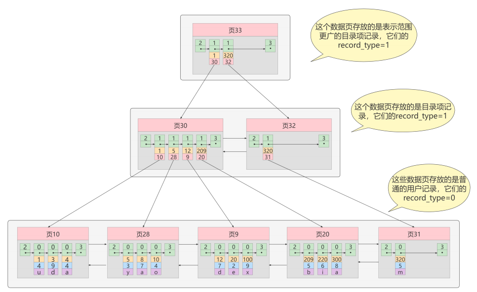

如图，我们生成了一个存储更高级目录项的 页33，这个页中的两条记录分别代表 页30 和 页32，如果用户记录的主键值在 [1,320) 之间，则到 页30 中查找更详细的目录项记录，如果主键值 不小于320 的话，就到 页32 中查找更详细的目录项记录。

随着表中记录的增加，这个目录的层级会继续增加，如果简化一下，我们可以用下边这个图来描述它:

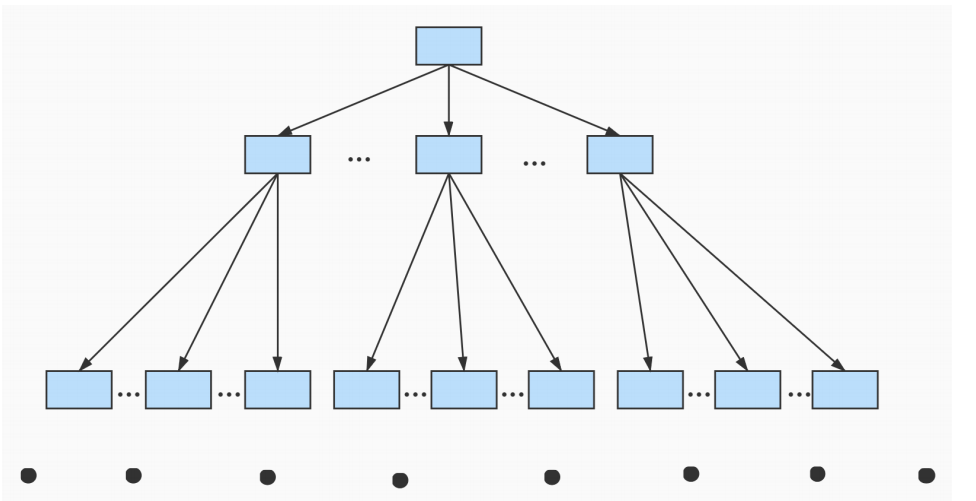

这个数据结构，它的名称是 `B+树`

#### B+tree
不论是存放 用户记录 的数据页，还是存放 目录项记录 的数据页，我们都把它存放到 B+树 这个数据结构中，所以我们也称这些数据页为 节点。从图中可以看出，我们的实际用户记录其实都存放在 B+树 的最底层的节点上，这些节点也被称为 叶子结点，其余用来存放目录项的节点称为 非叶子节点 或者 内节点，其中 B+树 最上边的那个节点也称为 根节点。

一个 B+树 的节点其实可以分成好多层，规定最下边的那层，也就是存放我们用户记录的那层为第0层，之后一次往上加。之前我们做了一个非常极端的假设: 存放用户记录的页，最多存放 3 条记录，存放目录项记录的页，最多存放 4条记录。其实真实环境中一个页存放的记录数是非常大的，假设所有存放用户记录的叶子节点代表的数据页可以存放100条用户记录，所有存放目录项记录的内节点代表的数据页可以存放 1000条目录项记录，那么：
- 如果 B+ 树只有1层，也就是只有一个用于存放用户记录的节点，最多能存放 100条记录。
- 如果 B+ 树有2层，最多能存放 1000*100=100000条记录。
- 如果 B+ 树有3层，最多能存放 1000*1000*100=100000000条记录。
- 如果 B+ 树有4层，最多能存放 1000*1000*1000*100=100000000000条记录。

你的表里能存放下100000000000条记录吗？所以一般情况下，我们用到的 B+树 都不会超过4层，那我们通过主键值去查找某条记录最多只需要做 4个页面内的查找(查找3个目录项页和一个用户记录页)，又因为在每个页面内有所谓的 Page Directory(页目录)，所以在页面内也可以通过 二分法 实现快速定位记录 


## 5.3 常见索引概念
索引按照物理实现方式，分为 2 中: 聚簇索引 和 非聚簇索引。我们也把 非聚簇索引 称为 耳机索引 或者叫 辅助索引。

### 5.3.1 聚簇索引
聚簇索引并不是一种单独的索引类型，而是一种数据存储方式(所有的用户记录都存储在了叶子节点)，也就是所谓的 索引即数据，数据即索引。

> 聚簇: 表示数据行和相邻的键值聚簇的存储在一次。

在数据页中，记录和记录之间是单项列表，在数据页之间是双向列表。

聚簇索引特点:
1. 使用记录主键值的大小进行记录和页的排序，这包括三个方面的含义：
   1. 页内的记录是按照主键的大小顺序排成一个单项列表。
   2. 各个存放用户记录的页，也是根据页中用户记录的主键大小顺序排成一个双向链表。
   3. 存放目录项记录的页，分为不同的层次，在同一层次中的页，也是根据页中目录项记录的主键大小排序成一个双向链表。
2. B+ 树的叶子结点存储的是完整的用户记录
   所谓完整的用户记录，就是指这个记录中存储了所有列的值(包括隐藏列)。

我们把具有这两种特性的 B+树 称为: `聚簇索引`，所有完整的用户记录都存放在这个 聚簇索引 的叶子节点处。这中聚簇索引并不需要我们在 MySQL 语句汇总显示的使用 INDEX 语句去创建， InnoDB 存储引擎会自动的为我们创建聚簇索引。

聚簇索引优点:
1. 数据访问更快，因为聚簇索引将索引和数据保存再同一个 B+ 树中，因此从聚簇索引中获取数据比 非聚簇索引更快。
2. 聚簇索引对于主键的 排序查找 和 范围查找 速度非常快。
3. 按照聚簇索引排列顺序，查询显示一定范围数据的时候，由于数据都是紧密相连的，数据库不用从多个数据块中提取数据，所以节省了大量的IO操作。

聚簇索引的缺点：
1. 插入速度严重依赖于插入顺序，按照主键的顺序插入是最快的方式，否则将会出现页分裂，严重影响性能。因此，对弈 InnoDB 表，我们一般都会定义一个自增的ID列为主键。
2. 更新主键的代价很高，因为将会导致被更新的行移动。因此，对于 InnoDB 表，我们一般定义主键为不可更新。
3. 二级索引访问需要两次索引查找，第一次找到主键值，第二次根据主键值找到行数据。

聚簇索引的限制：
1. 对于 MySQL 数据库目前只有 InnoDB 数据引擎支持聚簇索引，而 MyISAM 并不支持聚簇索引。
2. 由于数据物理存储排序方式只能有一种，所以每个 MySQL 的表只能有一个聚簇索引。一般情况下就是该表的主键。
3. 如果没有定义主键，InnoDB 会选择非空的唯一索引代替。如果没有这样的索引，InnoDB 会隐式的定义一个主键来作为聚簇索引。
4. 为了充分利用聚簇索引的聚簇特性，所以 InnoDB 表的主键列尽量选用有序的顺序id，而不建议选用无序id。比如: UUID、MD5、HASH、字符串作为主键无法保证数据的顺序增长。


### 5.3.2 二级索引(辅助索引、非聚簇索引)
上边介绍的聚簇索引只能在搜索条件是主键时才能发挥作用，因为 B+树 中的数据都是按照主键进行排序的。那如果我们想以别的列作为搜索条件该怎么办呢？肯定不能是从头到尾沿着链表依次遍历记录一遍。

我们可以多创建几棵B+树，不同的 B+树 中的数据采用不同的排序规则。比如我们用 c2列 的大小作为数据页、页中记录的排序规则，再创建一个 B+树，效果如果所示

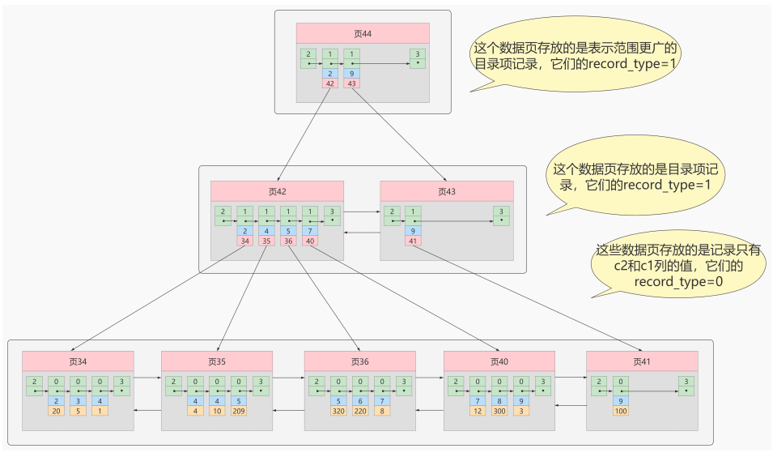

这个 B+树 与上边介绍的聚簇索引有几处不同：
1. 使用记录 c2 列的大小进行记录和页的排序，这包括三个方面的含义：
   1. 页内的记录是按照 c2 列的大小顺序排成一个单向列表。
   2. 各个存放 用户记录的页，也是根据页中记录的 c2 列大小顺序排成一个 双向链表。
   3. 存放 目录记录的页 分为不同的层次，在同一层次中的页也是根据页中目录项记录的 c2 列大小顺序排成一个 双向链表。
2. B+树 的叶子节点存储的并不是完整的用户记录，而只是 c2列+主键 这两个列的值。
3. 目录项记录中不再是主键+页号的搭配，而变成了 c2列+页号 的搭配。

所以，如果我们现在通过 c2列 的值查找某些记录的话，就可以使用我们刚刚创建好的这个 B+树了。以查找 c2 列的值 4 的记录为例，查找过程如下：
1. 确定 目录项记录页
   根据 根页面，也就是 页44，可以快速定位到数据项记录所在的页为 页42(因为 2<4<9).
2. 通过 目录项记录页 确定用户记录真实所在的页
   在 页42中，可以快速定位到实际存储用户记录的页，但是由于 c2 列并没有唯一性约束，所以 c2 列值为 4 的记录可能分布在多个数据页中，又因为 2<4≤4, 所以确定实际存储用户记录的页在 页34和页35 中。
3. 在真实存储用户记录的页中定位到具体的记录。
    到 页34 和 页35 中定位到具体的记录。
4. 但是这个 B+树 的叶子节点中记录只存储了 c2 和 c1(也就是主键)两个列，所以我们必须再根据主键值去聚簇索引中再查找一遍完整的用户记录(回表操作)。

`回表`: 我们根据这个以 c2列大小排序的 B+树 只能确定我们要查找记录的主键值，所以如果我们想根据 c2 列的值查找到完整的用户记录的话，仍然需要到 聚簇索引 中再查一遍，这个过程称为 回表。也就是根据 c2列 的值查询一条完整的用户记录需要使用到 2颗 B+树。

问题：为什么我们还需要一次回表操作呢？直接把完整的用户记录放到叶子节点不行吗？

回答：如果把完整的用户记录放到叶子节点是可以不用回表，但是太占地方了，相当于每建立一颗B+树，都需要把所有的用户记录都再拷贝一遍，这就有点太浪费存储空间了。

因为这种按照 非主键列 建立的 B+树需要一次回表操作才可以定位到完整的用户记录，所以这种 B+树 也被称为 二级索引(secondary index), 或者 辅助索引。由于我们使用的是 c2 列的大小作为 B+树 的排序规则，所以我们也称这个 B+树 是为 c2 列建立的索引。

非聚簇索引的存在不影响数据在聚簇索引中的组织，所以一张表可以有多个非聚簇索引。

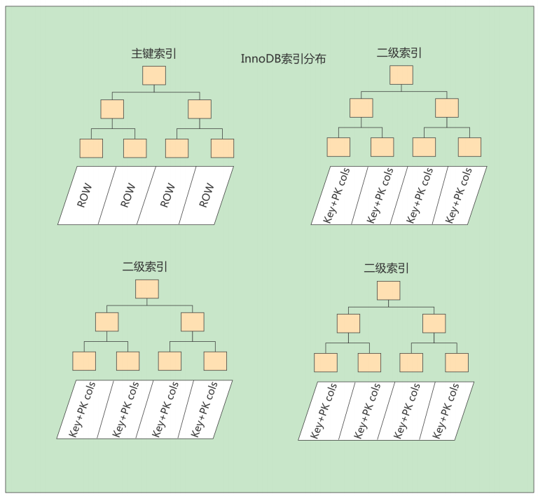

小结： 聚簇索引与非聚簇索引的原理不同，在使用上也有一些区别：
1. 聚簇索引的叶子节点，存储的就是我们的数据记录，非聚簇索引的叶子节点存储的是数据位置。非聚簇索引不会影响数据表的物理存储顺序。
2. 一个表只能有一个聚簇索引，因为只能有一种排序存储方式，但是可以有多个非聚簇索引，也就是多个索引目录提供数据检索。
3. 使用聚簇索引的时候，数据的查询效率高，但是如果对数据进行插入、删除、更新等操作，效率会比非聚簇索引低。


### 5.3.3 联合索引
我们也可以同时以多个列的大小作为排序规则，也就是同时为多个列建立索引，比方说我们想让 B+树 按照 c2和c3列 的大小记性排序，这包含了两层含义：
1. 先把各个记录和页按照 c2列 进行排序。
2. 在记录的 c2 列相同的情况下，采用 c3列 进行排序


如图所示，我们需要注意以下几个点:
1. 每个目录项记录都由 `c2、c3、页号` 这三个部分组成，各条记录先按照 c2 列的值进行排序，如果记录的 c2 列相同，则按照 c3 列的值进行排序。
2. B+树 叶子节点 处的用户记录由 c2、c3和主键c1列组成。

注意一点，以 c2和c3 列的大小为排序规则建立的 B+ 树称为 `联合索引`，本质上也是一个 二级索引。它的意思与分别为 c2和c3列 分别建立索引的表述是不同的，不同点如下：
1. 建立 **联合索引** 只会建立如上图一样的 1课B+树
2. 为 c2和c3列 分表建立索引会分别为 c2和c3列 的大小为排序规则建立 2颗B+树。

## 5.4 InnoDB 的 B+树索引的注意事项
### 5.4.1 根页面位置万年不动
我们前边介绍 B+树 索引的时候，为了大家理解上的方便，先把存储用户记录的叶子节点都画出来，然后接着画存储目录项记录的内节点，实际上 B+树 的形成过程是这样的:
1. 每当为某个表创建一个 B+树 索引(聚簇索引不是认为创建的，默认就有)的时候，都会为这个索引创建一个根节点页面。最开始表中没有数据的时候，每个 B+树 索引对应的根节点中既没有用户记录，也没有目录项记录。
2. 随后向表中插入用户记录时，先把用户记录存储到这个根节点中。
3. 当根节点中的可用空间用完时，继续插入记录，此时会将根节点中的所有记录复制到一个新分配的页，比如 页a 中，然后对这个新页进行页分裂的操作，得到另一个新页，比如 页b。这时新插入的记录会根据键值(也就是聚簇索引中的主键值、二级索引中对应的索引列的值)的大小就会被分配到页a或者页b中，而根节点便升级为存储目录项记录的页。

这个过程特别注意的是: 一个 B+树 索引的根节点自诞生之日起，便不会再移动。这样只要我们对某个表建立一个索引，那么它的根节点的页号便会被记录到某个地方，然后凡是 `InnoDB 存储引擎` 需要用到这个索引的时候，都会从那个固定的地方取出根节点的页号，从而来访问这个索引。

### 5.4.2 内节点中目录项记录的唯一性
我们知道 B+树 索引内的内节点中目录项记录的内容是: `索引列+页号` 的搭配，但是这个搭配对于耳机索引来说，有点不严谨。还是拿 index_demo 表为例，假设这个表中的数据是这样的:

| c1 | c2 | c3 |
| --- |--- |--- |
|1 | 1 | 'u' |
|3 | 1 | 'd' |
|5 | 1 | 'y' |
|7 | 1 | 'a' |

如果二级索引中目录项记录的内容只是 `索隐列+页号` 的搭配的话，那么为 c2列 建立索引后的 B+树 应该长这样:


如果我们想要新插入一行记录，启动 `c1、c2、c3` 的值分别是: `9、1、'c'`, 那么在修改这个为 c2列 建立的二级索引对应的 B+树 时，便碰到了个大问题: 由于 页3 中存储的目录项记录是由 `c2列+页号` 的值构成的，页3 中的两条目录项记录对应的c2列的值都是1，而我们新插入的这条记录的c2列的值也是1，那么我们这条新插入的记录到底应该放到页4中还是应该放到页5中？

为了让新插入记录能找到自己在哪个页里，我们需要保证在 B+树 的同一层内节点的目录项记录除页号这个字段以外是唯一的。所以对于二级索引的内节点的目录项记录的内容实际上是由三个部分构成的:
1. 索引列的值
2. 主键值
3. 页号

也就是我们把 主键值 也添加到二级索引内节点的目录项记录了，这样就能保证 B+树 每一层节点中各条目录项记录除页号这个字段外是唯一的，所以我们为 c2列 建立二级索引后的示意图实际上应该是这样子的


这样，我们再插入记录`(9, 1, 'c')`时，由于页3 中存储的目录项记录是由 `c2列+主键+页号`的值构成的，可以先把新纪录的 c2列 的值和 页3 中各目录项记录的 c2列 的值作比较，如果 c2列 的值相同的话，可以接着比较主键值，因为 B+树 同一层中不同目录项记录的 c2列+主键 的值肯定是不一样的，所以最后肯定能定位唯一的一条目录项记录，在本例中最后确定新纪录应该被插入到 页5 中。

### 5.4.3 一个页最少存储2条记录
一个 B+树 只需要很少的层级就可以轻松存储数亿条记录，查询速度相当不错。这是因为 B+树 本质上就是一个大的多层级目录，每经过一个目录时都会过滤掉许多无效的子目录，直到最后访问到存储真实数据的目录。

那如果一个大的目录中只存放一个子目录是个啥效果呢？那就是目录层级非常多，而且最后的那个存放真实数据的目录中只能存放一条记录。费了半天劲只能存放一条真实的用户记录？所以 InnoDB 的一个数据页至存放两条记录。

# 六、MyISAM 中的索引方案
B树索引使用存储引擎如下所示

| 索引/存储引擎 | MyISAM | InnoDB | Memory |
| --- | ---| --- |--------|
| B-Tree索引 | 支持 | 支持 | 支持     |

即使多个存储引擎支持同一种类型的索引，但是他们的实现原理也是不同的。

InnoDB 和 MyISAM 默认的索引是 BTree 索引，而 Memory 默认的索引是 Hash 索引。

MyISAM 引擎使用 B+Tree 所谓索引结构，叶子节点的 data 域存放的是 数据记录的地址。

## 6.1 MyISAM 索引的原理
我们知道 InnoDB 中，索引即数据，也就是聚簇索引的那颗B+树的叶子结点中已经把所有完整的用户记录都包含了，而MyISAM 的索引方案虽然也使用 B+Tree，但是却将 `索引和数据分开存储`。

- 将表中的记录按照记录的插入顺序单独存储在一个文件中，称之为数据文件。这个文件并不划分为若干个数据页，有多少记录就往这个文件中塞多少记录就成了。由于在插入数据的时候并没有可以按照主键大小排序，所以我们并不能在这些数据上使用二分法进行查找。
- 使用 MyISAM 存储引擎的表会把索引信息另外存储到一个称为 索引文件 的另一个文件中。MyISAM 会单独为表的主键创建一个索引，只不过在索引的叶子节点中，存储的不是完整的用户记录，而是`主键值+数据记录地址` 的组合。


这里设表一共有3列，假设我们以col1位主键，上面是一个 MyISAM 表的主键索引(primary key)示意。可以看出 MyISAM 的索引文件仅仅保存数据记录的地址。在 MyISAM 中，主键索引和二级索引(secondary key)在结构上没有任何区别，只是主键索引要求key是唯一的，而二级索引的key是可以重复的。

如果我们在col2 上建立一个 二级索引，则此索引的结构如下图所示

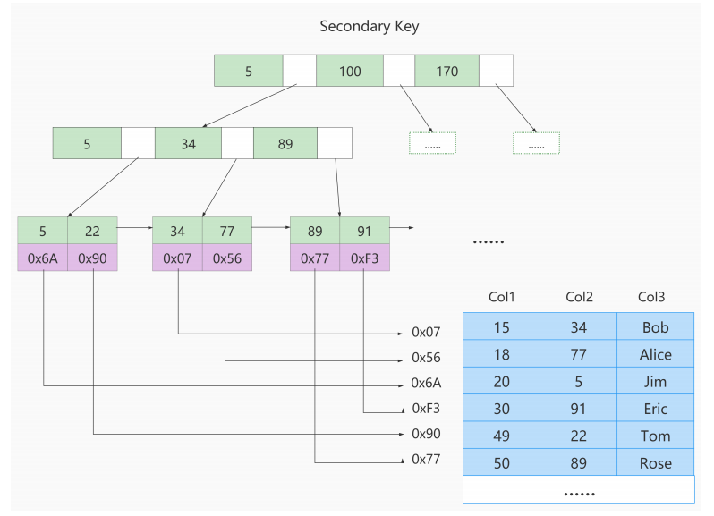

同样也是一颗 B+Tree，data域保存数据记录的地址。因此，MyISAM 中检索的算法为: 首先按照 B+Tree 搜索算法搜索索引，如果指定的Key存在，则取出其data域的值，然后以data域的值为地址，读取相应数据记录。

## 6.2 MyISAM和InnoDB对比
MyISAM 的索引方式都是 `非聚簇`的，与 InnoDB 包含一个 聚簇索引 是不同的。

1. 在 InnoDB 存储引擎中，我们只需要根据主键值对 `聚簇索引` 进行一次查找就能找到对应的记录，而在 MyISAM 中却需要进行一次 `回表` 操作，意味着 MyISAM 中建立的索引相同于全部都是 `二级索引`。
2. InnoDB 的数据文件本身就是索引文件，而 MyISAM 索引文件和数据文件是 分离的，索引文件仅保存数据记录的地址。
3. InnoDB 的非聚簇索引 data域，存储相应记录的`主键的值`，而 MyISAM 索引记录的是 `地址`。换句话说，InnoDB 的所有非聚簇索引都是引用主键作为 data域。
4. MyISAM 的回表操作是十分快速的，因为是拿着地址便宜量直接写到文件中取数据的，反观 InnoDB 是通过获取主键之后再去聚簇索引里找记录，虽然说也不慢，但是还是比不上直接用地址去访问。
5. InnoDB 要求表 `必须有主键(MyISAM 可以没有)`。如果没有显示的指定，MySQL系统会自动选择一个非空且唯一的列作为主键。如果不存在这种列，则MySQL自动为 InnoDB 表生成一个隐含字段作为主键，这个子弹长度为6个字节，类型为长整形。


## 小结
了解不同存储引擎的索引实现方式对于正确使用和优化索引都非常有帮助.

知道了 InnoDB 的索引实现后，就容易明白为什么不建议使用过长的字段作为主键，因为所有二级索引都引用主键索引，过长的主键索引会令二级索引变得过大。

用非单调的字段作为主键在 InnoDB 中不是一个好主意，因为 InnoDB 数据文件本身是一颗 B+Tree，非单调的主键会造成在插入新纪录时，数据文件为了维持 B+Tree 的特性而频繁的分裂调整，十分低效，而使用自增字段作为主键则是一个很好的选择。

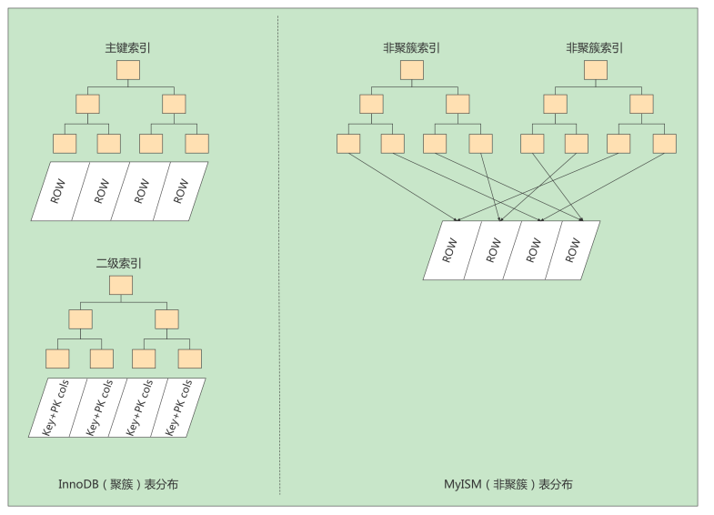

# 七、索引的代价
索引是个好东西，但是不能乱建，它在空间和时间上都会有消耗
- 空间上的代价:
  每建立一个索引都要为它建立一颗B+树，每一颗B+树的每一个节点都是一个数据页，一个页默认会占用 16kb的存储空间，一颗很大的 B+树 由许多数据页组成，那就是很大的一片存储空间。
- 时间上的代价:
  每次对表中的数据进行 `增、删、改`操作时，都需要去修改各个 B+树索引。而且我们讲过，B+树每层节点都是按照索引列的值 **从小到大的顺序排序**而组成了 **双向链表**。不论是叶子节点中的记录，还是内节点中的记录(也就是不论是用户记录还是目录项记录)都是按照索引列的值从小到大的顺序形成了一个单项链表。而 `增、删、改`操作可能会对节点和记录的排序造成破坏，所以存储引擎需要额外的时间进行一些**记录位移**、**页面分裂**、**页面回收**等操作来维护好节点和记录的排序。如果我们建立了许多索引，每个索引对应的 B+树 都要进行相关的维护操作，会给性能拖后腿。

> 一个表上索引建的越多，就会占用越多的存储空间，在增删改记录的时候性能就越差。

# 八、MySQL 数据结构选择的合理性
从 MySQL 的角度讲，不得不考虑一个现实问题就是磁盘IO。如果我们能让索引的数据结构尽量减少硬盘的IO操作，所消耗的时间也就越小。可以说，磁盘的IO操作次数，对索引的使用效率至关重要。

查找都是索引操作，一般来说索引非常大，尤其是关系型数据库，当数据量比较大的时候，索引的大小有可能几个G甚至更多，为了减少索引在内存的占用，数据库索引是存储在外部磁盘上的。当我们利用索引查询的时候，不可能把整个索引全部加载到内存，只能逐一加载，那么 MySQL 衡量查询效率的标准就是磁盘IO的次数。

## 8.1 全表遍历
略

## 8.2 Hash 结构
Hash 本身是一个函数，又被称为散列函数，它可以帮助我们大幅度提升检索数据的效率。

Hash 算法是通过某种确定性的算法(比如 MD5、SHA1、SHA2、SHA3)将输入转变为输出。相同的输入永远可以得到相同的输出，假设输入内容有微小的偏差，在输出中通常会有不同的结果。

例如想要验证两个文件是否相同，不需要把两份文件哪来对比，只需要让对方把 Hash 函数计算得到的结果告诉你即可，然后在本地同样对文件进行 Hash 函数的运算，最后通过比较这两个 Hash 函数的结果是否相同，就知道这两个文件是否相同。

加入查找速度的数据结构，常见的有两类：
1. 树：例如平衡二叉搜索树，查询、插入、修改、删除的平均时间复杂度都是O(log2N).
2. Hash: 例如 HashMap，查询、插入、修改、删除的平均时间复杂度都是O(1).

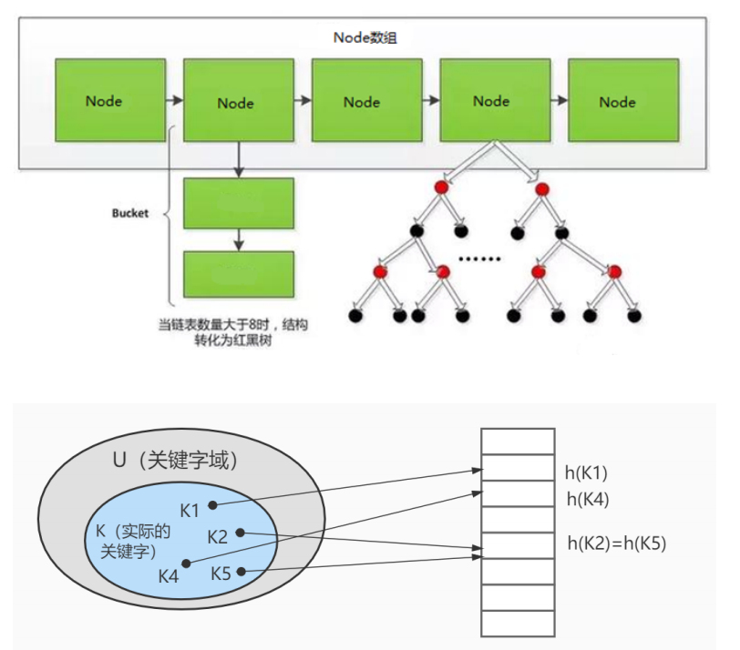

上图中，Hash 函数h 有可能将两个不同的关键字映射到相同的位置，这叫做 **碰撞**，在数据库中一般采用 **链接法**来解决。在链接法中，将散列到同一槽位的元素放在一个链表中，如下图所示


实验: 体会数组和Hash表的查找方面的效率区别
```java
// 算法复杂度为 O(n) 
@Test 
public void test1(){ 
	int[] arr = new int[100000];
	for(int i = 0;i < arr.length;i++){ 
		arr[i] = i + 1; 
    }

    long start = System.currentTimeMillis();
    for(int j = 1; j<=100000;j++){ 
	    int temp = j;

        for(int i = 0;i < arr.length;i++){ 
	        if(temp == arr[i]){ 
		        break; 
            } 
        } 
    }
	long end = System.currentTimeMillis(); 
	System.out.println("time： " + (end - start)); //time： 823 
}
```
```java
//算法复杂度为 O(1) 
@Test 
public void test2(){
    HashSet<Integer> set = new HashSet<>(100000);
    for(int i = 0;i < 100000;i++){ 	
        set.add(i + 1); 
    }
    
    long start = System.currentTimeMillis();
    for(int j = 1; j<=100000;j++) { 
        int temp = j; 
        boolean contains = set.contains(temp); 
    }
    long end = System.currentTimeMillis(); 
    System.out.println("time： " + (end - start)); //time： 5
 }
```
Hash 结构效率高，那为什么索引结构要设计成树形呢？

1. Hash 索引仅能满足(=、<、> 和 IN) 查询。如果进行范围查询，Hash型的索引，时间复杂度会退化为 O(n), 而树形的"有序"特性，依然能够保持O(log2n)的高效率。
2. Hash 索引还有一个缺陷，数据的存储是 **没有顺序的**，在`ORDER BY`的情况下，使用 Hash 索引还需要对数据重新排序。
3. 对于联合索引的情况，Hash值是将联合索引键合并后，再一起计算的，无法对单独的一个键或者几个索引键进行查询。
4. 对于等值查询来说，通常 Hash 索引的效率更高，不过也存在一种情况，就是 **索引列的重复值如果很多，效率就会降低**。这是因为遇到 Hash 碰撞时，需要遍历桶中的行指针来进行比较，找到查询的关键字，非常耗时。所以，Hash 索引通常不会用到重复值多的列上，比如列为性别、年龄的情况等。

hash 索引适用于存储引擎如表所示

| 索引/存储引擎 | MyISAM | InnoDB | Memory |
| --- | --- | --- | --- |
| Hash索引 | 不支持 | 不支持 | 支持 |

Hash索引存在着很多限制，相比之下在数据库中B+树索引的使用面会更广，不过也有一些场景采用 Hash索引效率更高，比如在键值型(Key-Value)数据库中，Redis 存储的核心就是 Hash 表。

MySQL 中的 Memory 存储引擎支持 Hash存储，如果我们需要用到查询的临时表时，就可以选择 Memory 存储引擎，把某个字段设置为 Hash索引，比如字符串类型的字段，进行 Hash计算之后长度可以缩短到几个字节。当字段的重复度低，而且经常需要进行等值查询的时候，采用 Hash 索引是不错的选择。

另外，InnoDB本身不支持Hash 索引，但是提供 **自适应Hash索引(Adaptive Hash Index)**。如果某个数据经常被访问，当满足一定条件的时候，就会将这个页的地址存放到 Hash表中，这样下次查询的时候，就可以直接找到这个页面的所在位置。这样让B+树也具备了Hash索引的有点。

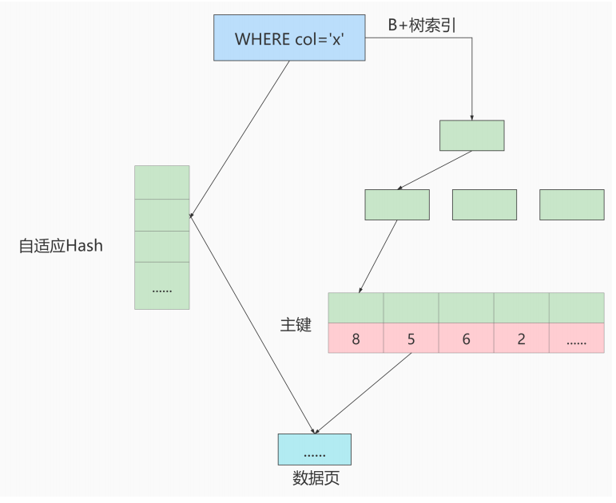

采用自使用Hash索引的目的是方便根据 SQL 的查询条件加速定位到叶子节点，特别是当 B+树比较深的时候，采用自适应 Hash 索引可以明显提高数据的检索效率。

我们可以通过 innodb_adaptive_hash_index 变量来查看是否开启了自适应 Hash
```mysql
mysql> show variables like '%adaptive_hash_index';
+----------------------------+-------+
| Variable_name              | Value |
+----------------------------+-------+
| innodb_adaptive_hash_index | ON    |
+----------------------------+-------+
1 row in set (0.00 sec)
```

## 8.3 二叉搜索树
如果我们利用二叉树作为索引结果，那么磁盘的 IO 次数和索引树的高度是相关的。

1. 二叉搜索树的特点
   - 一个节点只能有两个子节点
   - 左子节点 < 本节点 ≤ 右子节点，即：比我大的向右，比我小的向左。
2. 查找规则
    我们先来看下最基础的二叉搜索树(Binary Search Tree)，搜索某个节点和插入节点的规则一样，我们假设搜索的数值为 key:
   - 如果 key 大于根节点，则在右子树中进行查找；
   - 如果 key 小于根节点，则在左子树中进行查找；
   - 如果 key 等于根节点，即返回根节点即可。
   

举个例子，我们对数列(34, 22, 89, 5, 23, 77, 91) 创造出来的二分搜索树如下图所示

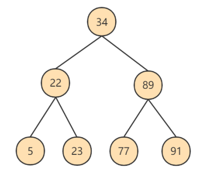

但是，存在特殊情况，就是二叉树的深度非常大。比如我们给出的数据顺序是(5, 22, 23, 34, 77, 89, 91), 创造出来的二分搜索树就如下图所示
    
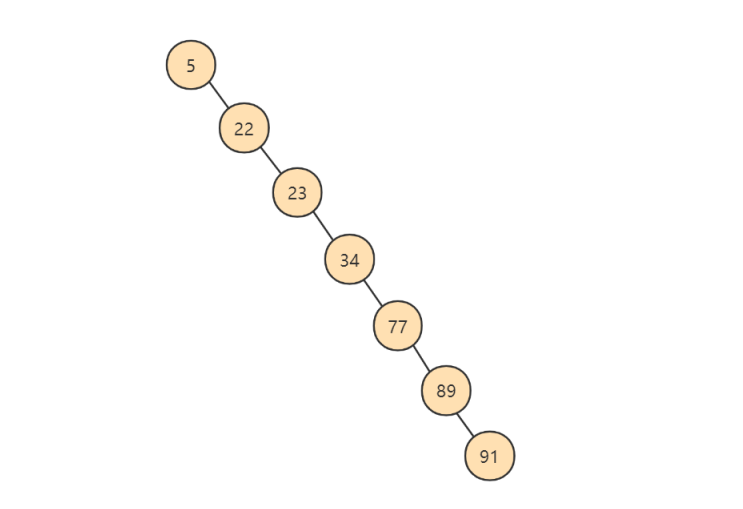
    
这棵树也属于二分搜索树，但是性能上已经退化成了一条链表，查找数据的时间复杂度变成了 O(n)。可以看出来，第一个树的深度是3，也就是说最多只需要3次比较，就可以找到节点，而第二个树的深度是7，最多需要7次比较才能找到节点。

为了提高查询效率，就需要减少磁盘IO次数。为了减少磁盘IO的次数，就需要尽量降低树的高度，需要把原来 "瘦高" 的树结构变成 "矮胖"，树每层的分叉越多越好。

## 8.4 AVL树
为了解决上面二叉查找树退化成链表的问题，人们提出了`平衡二叉搜索树(Balanced Binary Tree)`，又称为AVL树(有别于AVL算法)，它在二叉搜索树的基础上增加了约束，具有以下性质:

它是一棵空树或它的左右两个子树的高度差的绝对值不超过1，并且左右两个子树都是一棵平衡二叉树

这里说一下，常见的平衡二叉树有很多种，包括了`平衡二叉搜索树、红黑树、数堆、伸展树`。平衡二叉搜索树是最早提出来的自平衡二叉搜索树，当我们提到平衡二叉树时一般指的就是平衡二叉搜索树。事实上，第一棵树就属于平衡二叉搜索树，搜索时间复杂度就是o( log2n)。

数据查询的时间主要依赖于磁盘I/o的次数，如果我们采用二叉树的形式，即使通过平衡二叉搜索树进行了改进，树的深度也是o(log2n)，当n比较大时，深度也是比较高的，比如下图的情况:

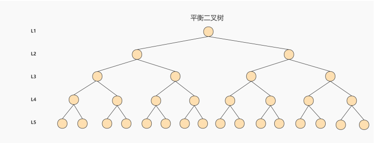

每访问一次节点就需要进行一次磁盘Ⅰ/О 操作，对于上面的树来说，我们需要进行5次I/O操作。虽然平衡二叉树的效率高，但是树的深度也同样高，这就意味着磁盘I/o操作次数多，会影响整体数据查询的效率。

针对同样的数据，如果我们把二叉树改成 M 叉树 （M>2）呢？当 M=3 时，同样的 31 个节点可以由下面的三叉树来进行存储：


你能看到此时树的高度降低了，当数据量N大的时候，以及树的分叉数M大的时候，M叉树的高度会远小于二叉树的高度(M >2)。所以，我们需要把树从“瘦高"变"矮胖”。

## 8.5 B-Tree
B树的英文是Balance Tree，也就是多路平衡查找树。简写为B-Tree (注意横杠表示这两个单词连起来的意思，不是减号)。它的高度远小于平衡二叉树的高度。

B 树的结构如下图所示：


B树作为多路平衡查找树，它的每一个节点最多可以包括M个子节点，M称为 B树的阶。每个磁盘块中包括了关键字和子节点的指针。如果一个磁盘块中包括了×个关键字，那么指针数就是x+1。对于一个100阶的B树来说，如果有3层的话最多可以存储约100万的索引数据。对于大量的索引数据来说，采用B树的结构是非常适合的，因为树的高度要远小于二叉树的高度。

一个 M 阶的 B 树（M>2）有以下的特性：
1. 根节点的儿子数的范围是 [2,M]。
2. 每个中间节点包含 k-1 个关键字和 k 个孩子，孩子的数量 = 关键字的数量 +1，k 的取值范围为[ceil(M/2), M]。
3. 叶子节点包括 k-1 个关键字（叶子节点没有孩子），k 的取值范围为 [ceil(M/2), M]。
4. 假设中间节点节点的关键字为：Key[1], Key[2], …, Key[k-1]，且关键字按照升序排序，即 Key[i] <Key[i+1]。此时 k-1 个关键字相当于划分了 k 个范围，也就是对应着 k 个指针，即为：P[1], P[2], …,P[k]，其中 P[1] 指向关键字小于 Key[1] 的子树，P[i] 指向关键字属于 (Key[i-1], Key[i]) 的子树，P[k]指向关键字大于 Key[k-1] 的子树。
5. 所有叶子节点位于同一层。

上面那张图所表示的 B 树就是一棵 3 阶的 B 树。我们可以看下磁盘块 2，里面的关键字为（8，12），它有 3 个孩子 (3，5)，(9，10) 和 (13，15)，你能看到 (3，5) 小于 8，(9，10) 在 8 和 12 之间，而 (13，15)大于 12，刚好符合刚才我们给出的特征。

然后我们来看下如何用 B 树进行查找。假设我们想要 查找的关键字是 9 ，那么步骤可以分为以下几步：
1. 我们与根节点的关键字 (17，35）进行比较，9 小于 17 那么得到指针 P1；
2. 按照指针 P1 找到磁盘块 2，关键字为（8，12），因为 9 在 8 和 12 之间，所以我们得到指针 P2；
3. 按照指针 P2 找到磁盘块 6，关键字为（9，10），然后我们找到了关键字 9。

你能看出来在 B 树的搜索过程中，我们比较的次数并不少，但如果把数据读取出来然后在内存中进行比较，这个时间就是可以忽略不计的。而读取磁盘块本身需要进行 I/O 操作，消耗的时间比在内存中进行比较所需要的时间要多，是数据查找用时的重要因素。 B 树相比于平衡二叉树来说磁盘 I/O 操作要少 ，在数据查询中比平衡二叉树效率要高。所以 只要树的高度足够低，IO次数足够少，就可以提高查询性能 。

小结:
1. B树在插入和删除节点的时候如果导致树不平衡，就通过自动调整节点的位置来保持树的自平衡。
2. 关键字集合分布在整棵树中,即叶子节点和非叶子节点都存放数据。搜索有可能在非叶子节点结束
3. 其搜索性能等价于在关键字全集内做一次二分查找。


## 8.6 B+Tree
B+树也是一种多路搜索树，基于B树做出了改进，主流的DBMS都支持B+树的索引方式，比如MySQL。相比于B-Tree，B+Tree适合文件索引系统。

MySQL官网说明：


### 8.6.1 B+ 树和 B 树的差异：
1. 有 k 个孩子的节点就有 k 个关键字。也就是孩子数量 = 关键字数，而 B 树中，孩子数量 = 关键字数+1
2. 非叶子节点的关键字也会同时存在在子节点中，并且是在子节点中所有关键字的最大（或最小）。
3. 非叶子节点仅用于索引，不保存数据记录，跟记录有关的信息都放在叶子节点中。而 B 树中， 非 叶子节点既保存索引，也保存数据记录 。
4. 所有关键字都在叶子节点出现，叶子节点构成一个有序链表，而且叶子节点本身按照关键字的大小从小到大顺序链接。

下图就是一棵B+树，阶数为3，根节点中的关键字1、18、35分别是子节点(1，8，14)， (18，24，31）和(35，41，53)中的最小值。每一层父节点的关键字都会出现在下一层的子节点的关键字中，因此在叶子节点中包括了所有的关键字信息，并且每一个叶子节点都有一个指向下一个节点的指针，这样就形成了一个链表。

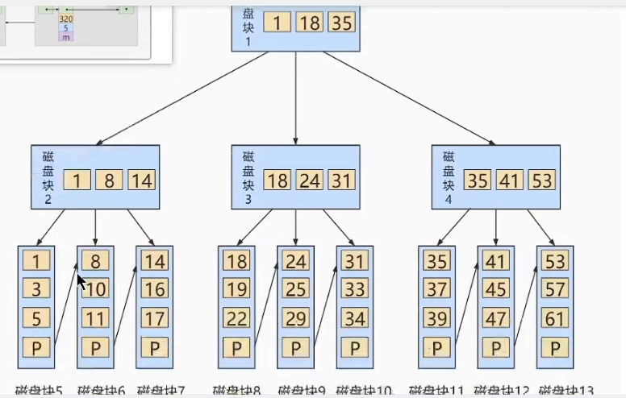

比如，我们想要查找关键字16, B+ 树会自顶向下逐层进行查找: .
1. 与根节点的关键字(1, 18，35)进行比较，16 在1和18之间，得到指针P1 (指向磁盘块2)
2. 找到磁盘块2,关键字为(1, 8, 14) ，因为16大于14，所以得到指针P3 (指向磁盘块7)
3. 找到磁盘块7,关键字为(14, 16, 17)，然后我们找到了关键字16，所以可以找到关键字16所对应的数据

整个过程一共进行了3次1/0操作,看起来B+树和B树的查询过程差不多,但是B+树和B树有个根本的差异在于，B+树的中间节点并不直接存储数据。这样的好处都有什么呢?

首先，B+树查询效率更稳定。因为B+树每次只有访问到叶子节点才能找到对应的数据，而在B树中，非叶子节点也会存储数据，这样就会造成查询效率不稳定的情况，有时候访问到了非叶子节点就可以找到关键字，而有时需要访问到叶子节点才能找到关键字。

其次，B+ 树的查询效率更高。这是因为通常B+树比B树更矮胖(阶数更大， 深度更低)，查询所需要的磁盘I/O也会更少。同样的磁盘页大小，B+ 树可以存储更多的节点关键字。

不仅是对单个关键字的查询上，在查询范围上，B+ 树的效率也比B树高。这是因为所有关键字都出现在B+树的叶子节点中，叶子节点之间会有指针，数据又是递增的，这使得我们范围查找可以通过指针连接查找。而在B树中则需要通过中序遍历才能完成查询范围的查找，效率要低很多。

> B 树和 B+ 树都可以作为索引的数据结构，在 MySQL 中采用的是 B+ 树。
> 
> 但B树和B+树各有自己的应用场景，不能说B+树完全比B树好，反之亦然。

思考题：为了减少IO，索引树会一次性加载吗？
> 1、数据库索引是存储在磁盘上的，如果数据量很大，必然导致索引的大小也会很大，超过几个G。
> 
> 2、当我们利用索引查询时候，是不可能将全部几个G的索引都加载进内存的，我们能做的只能是:逐一加载每一个磁盘页，因为磁盘页对应着索引树的节点。

思考题：B+树的存储能力如何？为何说一般查找行记录，最多只需1~3次磁盘IO
> InnoDB存储弓|擎中页的大小为16KB, 一般表的主键类型为INT (占用4个字节)或BIGINT (占用8个字节)，指针类型也一般为4或8个字节，也就是说一个页(B+Tree 中的一个节点)中大概存储16KB/(8B+8B)=1K个键值(因为是估值，为方便计算，这里的K取值为10^3。也就是说一个深度为3的B+Tree索引可以维护10^3 * 10^3 * 10^3 = 10亿条记录。(这里假定一个数据页也存储10^3条行记录数据 了)
> 
> 实际情况中每个节点可能不能填充满，因此在数据库中，B+Tree 的高度一般都在2~4层。MySQL 的InnoDB存储引擎在设计时是将根节点常驻内存的，也就是说查找某一键值的行记录时最多只需要 1~3次磁盘1/0操作。

思考题：为什么说B+树比B-树更适合实际应用中操作系统的文件索引和数据库索引？
> 1、B+树的磁盘读写代价更低
> 
> B+树的内部结点并没有指向关键字具体信息的指针。因此其内部结点相对B树更小。如果把所有同一内部结点的关键字存放在同一盘块中，那么盘块所能容纳的关键字数量也越多。一次性读入内存中的需要查找的关键字也就越多。相对来说I0读写次数也就降低了。
> 
> 2、B+树的查询效率更加稳定
> 
> 由于非终结点并不是最终指向文件内容的结点，而只是叶子结点中关键字的索引。所以任何关键字的查找必 须走一条从根结点到叶子结点的路。 所有关键字查询的路径长度相同，导致每一个数据的查询效率相当。

思考题：Hash 索引与 B+ 树索引的区别
> 我们之前讲到过B+树索引的结构，Hash 索引结构和B+树的不同，因此在索引使用上也会有差别。
> 
> 1、Hash索引不能进行范围查询，而B+树可以。这是因为Hash索引指向的数据是无序的，而B+树的叶子节点是个有序的链表。
> 
> 2、Hash 索引不支持联合索引的最左侧原则(即联合索引的部分索引无法使用)，而B+树可以。对于联合索引来说，Hash 索引在计算Hash值的时候是将索引键合并后再一起计算Hash值，所以不会针对每个索引单独计算Hash值。因此如果用到联合索引的一个或者几个索引时，联合索引无法被利用。
> 
> 3、Hash 索引不支持ORDER BY排序，因为Hash索引指向的数据是无序的，因此无法起到排序优化的作用，而B+树索引数据是有序的，可以起到对该字段ORDER BY排序优化的作用。同理，我们也无法用Hash索引进行模糊查询，而B+树使用LIKE进行模糊查询的时候，LIKE 后面后模糊查询(比如%结尾)的话就可以起到优化作用
> 
> 4。innodb不支持哈希索引

思考题：Hash 索引与 B+ 树索引是在建索引的时候手动指定的吗？
> 如果使用的是MySQL的话，我们需要了解MySQL的存储引擎都支持哪些索引结构，如下图所示(参考来源https://dev.mysql.com/doc/refman/8.0/en/create-index.html)。如果是其他的DBMS,可以参考相关的DBMS文档。
> 

> 
> 你能看到，针对InnoDB和MyISAM存储引擎，都会默认采用B+树索引，无法使用Hash索引。InnoDB 提供的自适应Hash是不需要手动指定的。如果是Memory/Heap和NDB存储引擎，是可以进行选择Hash索引的。


## 8.7 R树
R-Tree在MySQL很少使用，仅支持 geometry数据类型 ，支持该类型的存储引擎只有myisam、bdb、 innodb、ndb、archive几种。举个R树在现实领域中能够解决的例子：查找20英里以内所有的餐厅。如果没有R树你会怎么解决？一般情况下我们会把餐厅的坐标(x,y)分为两个字段存放在数据库中，一个字段记录经度，另一个字段记录纬度。这样的话我们就需要遍历所有的餐厅获取其位置信息，然后计算是否满足要求。如果一个地区有100家餐厅的话，我们就要进行100次位置计算操作了，如果应用到谷歌、百度地图这种超大数据库中，这种方法便必定不可行了。R树就很好的 解决了这种高维空间搜索问题 。它把B树的思想很好的扩展到了多维空间，采用了B树分割空间的思想，并在添加、删除操作时采用合并、分解结点的方法，保证树的平衡性。因此，R树就是一棵用来 存储高维数据的平衡树 。相对于B-Tree，R-Tree的优势在于范围查找。


# 附录：算法的时间复杂度
同一问题可用不同算法解决，而一个算法的质量优劣将影响到算法乃至程序的效率。算法分析的目的在于选择合适算法和改进算法。

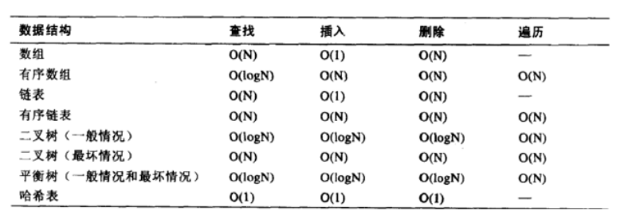


