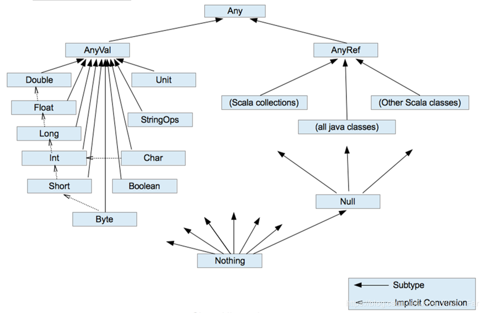
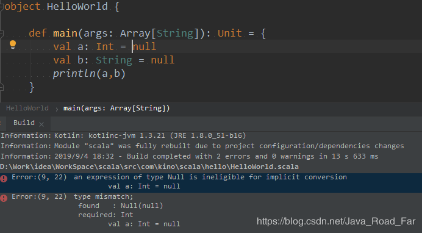
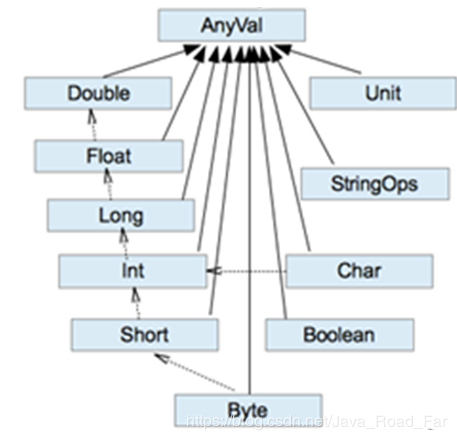

* [一、注释](#%E4%B8%80%E6%B3%A8%E9%87%8A)
* [二、标识符的命令规范](#%E4%BA%8C%E6%A0%87%E8%AF%86%E7%AC%A6%E7%9A%84%E5%91%BD%E4%BB%A4%E8%A7%84%E8%8C%83)
* [三、 Scala关键字（39个）](#%E4%B8%89-scala%E5%85%B3%E9%94%AE%E5%AD%9739%E4%B8%AA)
* [四、变量](#%E5%9B%9B%E5%8F%98%E9%87%8F)
* [五、键盘输入](#%E4%BA%94%E9%94%AE%E7%9B%98%E8%BE%93%E5%85%A5)
* [六、数据类型关系](#%E5%85%AD%E6%95%B0%E6%8D%AE%E7%B1%BB%E5%9E%8B%E5%85%B3%E7%B3%BB)
* [七、数据类型](#%E4%B8%83%E6%95%B0%E6%8D%AE%E7%B1%BB%E5%9E%8B)
* [八、类型转换](#%E5%85%AB%E7%B1%BB%E5%9E%8B%E8%BD%AC%E6%8D%A2)

---


# 一、注释
单行注释: 
```scala
  // 单行注释
```

多行注释: 
```scala
/* 
   多行注释 
 */
```

文本注释: 
```scala
/*
 * 文本注释
 */ 
```
---
# 二、标识符的命令规范
Scala中的标识符声明，基本和Java是一致的，但是细节上会有所变化，有以下四种规
- 以字母或者下划线开头，后接字母、数字、下划线
- 以操作符开头，且只包含操作符（+ - * / # !等）
- 第一种和第二种拼接，第一种在前，二者以下划线分隔
- 用反引号`....`包括的任意字符串，即使是关键字（39个）也可以

```java
hello    // ok
hello12  // ok
1hello   // error
h-b      // error
x h      // error
h_4      // ok
_ab      // ok
Int      // ok , 因为在Scala Int是预定义的字符,不推荐
Float    // ok 
_        // error ,单独一个下划线不可以作为标识符
Abc      // ok
+*-      // ok
+a       // error
$a		 // ok , 但不要让scala的标识符出现$,因为scala编译器会使用$
```
---
# 三、 Scala关键字（39个）
- package, import, class, <font color='red'>object, trait</font>, extends, <font color='red'>with</font>, type, for
- private, protected, abstract, <font color='red'>sealed</font>, final,<font color='red'> implicit</font>, lazy, override
- try, catch, finally, throw 
- if, else,<font color='red'> match</font>, case, do, while, for, return, <font color='red'>yield</font>
- <font color='red'>def, val, var </font>
- this, super
- new
- true, false, null

---
# 四、变量
基本语法: `var | val 变量名 [: 变量类型] = 变量值`
- var: 变量, val: 常量, 初始化后不可更改
- 说明: 在Scala中声明一个变量时, 可以不指定类型, 编译器根据值确定
- 声明变量时, 类型可以省略（编译器自动推导, 即类型推导）
- 类型确定后, 就不能修改, 说明Scala是强数据类型语言.
- 变量声明时, 需要初始值
```java
package com.kino.chapter03

object TestVar {

    def main(args: Array[String]): Unit = {

        //（1）声明变量时，类型可以省略（编译器自动推导，即类型推导）
        var age = 18
        age = 30

        //（2）类型确定后，就不能修改，说明Scala是强数据类型语言。
//        age = "tom" // 错误

        //（3）变量声明时，需要初始值
//        var name //错误

		var num1 = 10   // 可变
        val num2 = 20   // 不可变

        num1 = 30  // 正确
        //num2 = 100  //错误，因为num2是val修饰的
    }
}
```
---
# 五、键盘输入
在编程中，需要接收用户输入的数据，就可以使用键盘输入语句来获取。
- 基本语法
`StdIn.readLine()`、`StdIn.readShort()`、`StdIn.readDouble()`
- 需求：可以从控制台接收用户信息，【姓名，年龄，薪水】。
	```java
	import scala.io.StdIn
	
	object TestInput {
	
	    def main(args: Array[String]): Unit = {
	
	        // 1 输入姓名
	        println("input name:")
	        var name = StdIn.readLine()
	
	        // 2 输入年龄
	        println("input age:")
	        var age = StdIn.readShort()
	
	        // 3 输入薪水
	        println("input sal:")
	        var sal = StdIn.readDouble()
	
	        // 4 打印
	        println("name=" + name)
	        println("age=" + age)
	        println("sal=" + sal)
	    }
	}
	```

---
# 六、数据类型关系

- 特殊说明

  ① `AnyVal` 下的 `Unit`: 表示没有返回值, 和java中的 void 类似
	```scala
	def say(): Unit = {
		println("你好")
	}
	```

	② `AnyRef` 下的 `Null`: 是一个类型, 该类型是引用类型的子类, 所有的引用类型都可以声明为 null, 值类型则不可以声明为null
	
	③ Nothing： 是所有类型的子类，作用是帮助 scala 做**类型推导**
	```scala
	object TestSpecialType {
	
	    def main(args: Array[String]): Unit = {
	
	        def test() : Nothing={
	            throw new Exception()
	        }
	        test
	    }
	}
	```

---
	
# 七、数据类型
整数类型(Byte、Short、Int、Long)
浮点类型(Float、Double)
字符型(Char)
布尔型(Boolean)

和 Java 中一致

---
# 八、类型转换
1. 数值类型隐式转换
当Scala程序在进行赋值或者运算时，精度小的类型自动转换为精度大的数值类型，这个就是自动类型转换（隐式转换）。数据类型按精度（容量）大小排序为

	- 自动提升原则：有多种类型的数据混合运算时，系统首先自动将所有数据转换成精度大的那种数据类型，然后再进行计算。
	- 当我们把精度大的数值类型赋值给精度小的数值类型时，就会报错，反之就会进行自动类型转换。
	- （byte，short）和char之间不会相互自动转换。
	- byte，short，char他们三者可以计算，在计算时首先转换为int类型。


2. 强制类型转换： 使用 `.toxxx`的方式进行转换
自动类型转换的逆过程，将精度大的数值类型转换为精度小的数值类型。使用时要加上强制转函数，但可能造成精度降低或溢出，格外要注意。

	当进行数据的从大——>小，就需要使用到强制转换
	```java
	var n1: Int = 2.5.toInt // 这个存在精度损失
	
	var r1: Int = 10 * 3.5.toInt + 6 * 1.5.toInt  // 10 *3 + 6*1 = 36
	
	var r2: Int = (10 * 3.5 + 6 * 1.5).toInt  // 44.0.toInt = 44

	var c2: Char = 98 // 正确，因为直接将一个数值给char，编译器只判断是否越界

	var c3: Char = 'a' + 1 // 错误，Int高->char低，编译器判断类型

	var c4: Char = ('a' + 1).toChar

	var a : Short = 5
    // a = a-2 // 错误， Int->Short

    var b : Byte = 3
    // b = b + 4 // 错误，Int->Byte
	```