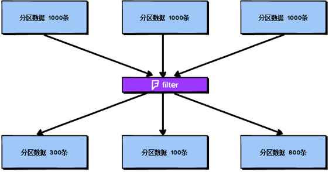
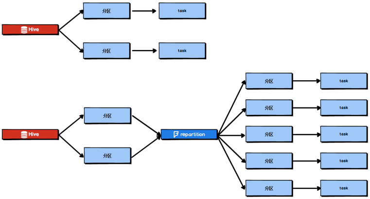
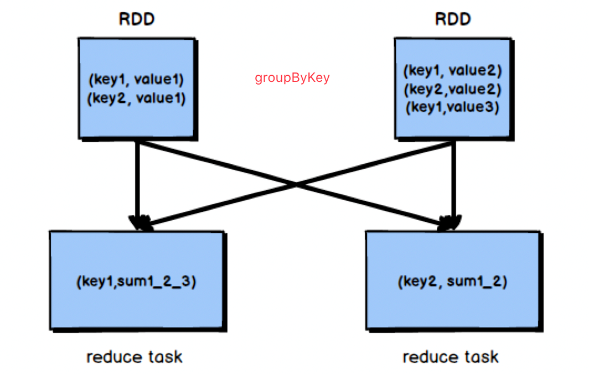

* [一、常规性能调优](#%E4%B8%80%E5%B8%B8%E8%A7%84%E6%80%A7%E8%83%BD%E8%B0%83%E4%BC%98)
  * [1\.1 最优资源配置](#11-%E6%9C%80%E4%BC%98%E8%B5%84%E6%BA%90%E9%85%8D%E7%BD%AE)
  * [1\.2 RDD 优化](#12-rdd-%E4%BC%98%E5%8C%96)
    * [① RDD 复用](#-rdd-%E5%A4%8D%E7%94%A8)
    * [② RDD 持久化](#-rdd-%E6%8C%81%E4%B9%85%E5%8C%96)
    * [③ RDD 尽可能早的 filter 操作](#-rdd-%E5%B0%BD%E5%8F%AF%E8%83%BD%E6%97%A9%E7%9A%84-filter-%E6%93%8D%E4%BD%9C)
  * [1\.3 并行度调节](#13-%E5%B9%B6%E8%A1%8C%E5%BA%A6%E8%B0%83%E8%8A%82)
  * [1\.4 广播大变量](#14-%E5%B9%BF%E6%92%AD%E5%A4%A7%E5%8F%98%E9%87%8F)
  * [1\.5 Kryo 序列化](#15-kryo-%E5%BA%8F%E5%88%97%E5%8C%96)
  * [1\.6 调节本地化等待时间](#16-%E8%B0%83%E8%8A%82%E6%9C%AC%E5%9C%B0%E5%8C%96%E7%AD%89%E5%BE%85%E6%97%B6%E9%97%B4)
* [2\. 算子调优](#2-%E7%AE%97%E5%AD%90%E8%B0%83%E4%BC%98)
  * [2\.1 mapPartitions](#21-mappartitions)
  * [2\.2 foreachPartition 优化数据库操作](#22-foreachpartition-%E4%BC%98%E5%8C%96%E6%95%B0%E6%8D%AE%E5%BA%93%E6%93%8D%E4%BD%9C)
  * [2\.3 filter 与 coalesce 的配合使用](#23-filter-%E4%B8%8E-coalesce-%E7%9A%84%E9%85%8D%E5%90%88%E4%BD%BF%E7%94%A8)
  * [2\.4 repartition 解决 SparkSQL 低并行度问题](#24-repartition-%E8%A7%A3%E5%86%B3-sparksql-%E4%BD%8E%E5%B9%B6%E8%A1%8C%E5%BA%A6%E9%97%AE%E9%A2%98)
  * [2\.5 reduceByKey 预聚合](#25-reducebykey-%E9%A2%84%E8%81%9A%E5%90%88)
* [3\. Shuffle 调优](#3-shuffle-%E8%B0%83%E4%BC%98)
  * [3\.1 调节map端缓冲区大小](#31-%E8%B0%83%E8%8A%82map%E7%AB%AF%E7%BC%93%E5%86%B2%E5%8C%BA%E5%A4%A7%E5%B0%8F)
  * [3\.2 调节reduce端拉取数据缓冲区大小](#32-%E8%B0%83%E8%8A%82reduce%E7%AB%AF%E6%8B%89%E5%8F%96%E6%95%B0%E6%8D%AE%E7%BC%93%E5%86%B2%E5%8C%BA%E5%A4%A7%E5%B0%8F)
  * [3\.3 调节reduce端拉取数据重试次数](#33-%E8%B0%83%E8%8A%82reduce%E7%AB%AF%E6%8B%89%E5%8F%96%E6%95%B0%E6%8D%AE%E9%87%8D%E8%AF%95%E6%AC%A1%E6%95%B0)
  * [3\.4 调节reduce端拉取数据等待间隔](#34-%E8%B0%83%E8%8A%82reduce%E7%AB%AF%E6%8B%89%E5%8F%96%E6%95%B0%E6%8D%AE%E7%AD%89%E5%BE%85%E9%97%B4%E9%9A%94)
  * [3\.5 调节SortShuffle排序操作阈值](#35-%E8%B0%83%E8%8A%82sortshuffle%E6%8E%92%E5%BA%8F%E6%93%8D%E4%BD%9C%E9%98%88%E5%80%BC)
* [4\. JVM 调优](#4-jvm-%E8%B0%83%E4%BC%98)
  * [4\.1 降低cache操作的内存占比](#41-%E9%99%8D%E4%BD%8Ecache%E6%93%8D%E4%BD%9C%E7%9A%84%E5%86%85%E5%AD%98%E5%8D%A0%E6%AF%94)
    * [静态内存管理机制](#%E9%9D%99%E6%80%81%E5%86%85%E5%AD%98%E7%AE%A1%E7%90%86%E6%9C%BA%E5%88%B6)
    * [统一内存管理机制](#%E7%BB%9F%E4%B8%80%E5%86%85%E5%AD%98%E7%AE%A1%E7%90%86%E6%9C%BA%E5%88%B6)
  * [4\.2 调节Executor堆外内存](#42-%E8%B0%83%E8%8A%82executor%E5%A0%86%E5%A4%96%E5%86%85%E5%AD%98)
  * [4\.3 调节连接等待时长](#43-%E8%B0%83%E8%8A%82%E8%BF%9E%E6%8E%A5%E7%AD%89%E5%BE%85%E6%97%B6%E9%95%BF)


---
# 一、常规性能调优
## 1.1 最优资源配置
Spark 性能调优的第一步, 就是为任务分配更多的资源, 在一定的范围内, 增加资源的分配与性能的提升是成正比的, 实现了最优的资源配置后, 在此基础上在考虑进行后面的性能调优策略。

资源的分配, 在使用脚本提交任务时进行指定, 标准的 Spark 任务提交脚本代码如下:
```bash
spark-submit --class com.kino.spark.Analysis /
--num-executors 80 / 
--driver-memory 6g / 
--executor-momery 6g / 
--executor-core 3 / 
/usr/opt/modules/spark/jar/spark.jar
```
说明:
- -num-executors: 配置 Executor 的数量
- -driver-momery: 配置 Driver 内存(影响不大)
- -executor-memory: 配置每个 Executor 的内存大小
- -executor-cores: 配置每个 Executor 的 CPU core 数量

调节原则: 尽量将任务分配的资源调节到可以使用的资源的最大限度.

对于具体资源的分配, 我们分别讨论 Spark 的两种运行模式:
- 第一种是 Spark Standalone 模式, 你在提交任务之前, 一定知道或者可以从运维部门获取到你可以使用的资源情况, 在编写 spark-submit 脚本的时候, 就根据可以使用的资源情况进行资源的分配, 比如说集群有 15 台机器, 每台机器为 8G 内存, 2 个 CPU core, 那么就指定 15 个 Executor, 每个 Executor 分配 8G 内存, 2 个 CPU core。
- 第二种用是 Spark Yarn 模式, 由于 Yarn使用资源队列进行资源的分配和调度, 在写 spark-submit 脚本的时候, 就根据 Spark 作业要提交到的资源队列, 进行资源的分配, 比如资源队列有 400G 内存, 100 个 CPU core, 那么指定 50 个 Executor, 每个 Executor 分配 8G 内存, 2 个 CPU core.

| 名称 | 解析 | 
--- | ---
增加 Executor 个数 | 在资源允许的情况下，增加Executor的个数可以提高执行task的并行度。比如有4个Executor，每个Executor有2个CPU core，那么可以并行执行8个task，如果将Executor的个数增加到8个（资源允许的情况下），那么可以并行执行16个task，此时的并行能力提升了一倍。
增加每个Executor的CPU core个数 | 在资源允许的情况下，增加每个Executor的Cpu core个数，可以提高执行task的并行度。比如有4个Executor，每个Executor有2个CPU core，那么可以并行执行8个task，如果将每个Executor的CPU core个数增加到4个（资源允许的情况下），那么可以并行执行16个task，此时的并行能力提升了一倍。
增加每个Executor的内存量 | 在资源允许的情况下，增加每个Executor的内存量以后，对性能的提升有三点： 1. 可以缓存更多的数据（即对RDD进行cache），写入磁盘的数据相应减少，甚至可以不写入磁盘，减少了可能的磁盘IO； 2. 可以为shuffle操作提供更多内存，即有更多空间来存放reduce端拉取的数据，写入磁盘的数据相应减少，甚至可以不写入磁盘，减少了可能的磁盘IO； 3. 可以为task的执行提供更多内存，在task的执行过程中可能创建很多对象，内存较小时会引发频繁的GC，增加内存后，可以避免频繁的GC，提升整体性能。

生产环境 spark-submit 脚本配置:
```bash
spark-submit /
--class com.kino.spark.WordCount /
--num-executors 80 /
--driver-memory 6g /
--executor-memory 6g /
--executor-cores 3 /
--master yarn /
--deploy-mode cluster /
--queue root.default /
--conf spark.yarn.executor.memoryOverhead=2048 /
--conf spark.core.connection.ack.wait.timeout=300 /
/usr/local/spark/spark.jar
```
- --num-executors：50~100
- --driver-memory：1G~5G
- --executor-memory：6G~10G
- --executor-cores：3
- --master: yarn
- --deploy-mode:  cluster


## 1.2 RDD 优化
### ① RDD 复用
在对RDD进行算子时，要避免相同的算子和计算逻辑之下对 RDD 进行重复的计算:


对上图中的RDD计算架构进行修改:


### ② RDD 持久化
在Spark中，当多次对同一个 RDD 执行算子操作时，每一次都会对这个 RDD 的祖先 RDD 重新计算一次，这种情况是必须要避免的，对同一个RDD的重复计算是对资源的极大浪费，因此，必须对多次使用的RDD进行持久化，通过持久化将公共RDD的数据缓存到内存/磁盘中，之后对于公共RDD的计算都会从内存/磁盘中直接获取RDD数据。 对于RDD的持久化，有两点需要说明：
- RDD的持久化是可以进行序列化的，当内存无法将RDD的数据完整的进行存放的时候，可以考虑使用序列化的方式减小数据体积，将数据完整存储在内存中。
- 2.	如果对于数据的可靠性要求很高，并且内存充足，可以使用副本机制，对RDD数据进行持久化。当持久化启用了复本机制时，对于持久化的每个数据单元都存储一个副本，放在其他节点上面，由此实现数据的容错，一旦一个副本数据丢失，不需要重新计算，还可以使用另外一个副本。


### ③ RDD 尽可能早的 filter 操作
获取到初始RDD后，应该考虑尽早地过滤掉不需要的数据，进而减少对内存的占用，从而提升Spark作业的运行效率。

## 1.3 并行度调节
Spark作业中的并行度指各个 stage 的 task 的数量。

如果并行度设置不合理而导致并行度过低，会导致资源的极大浪费，例如，20个 Executor，每个 Executor 分配 3 个CPU core，而Spark作业有 40 个task，这样每个Executor分配到的task个数是2个，这就使得每个Executor有一个CPU core空闲，导致资源的浪费。

理想的并行度设置，应该是让并行度与资源相匹配，简单来说就是在资源允许的前提下，并行度要设置的尽可能大，达到可以充分利用集群资源。合理的设置并行度，可以提升整个 Spark 作业的性能和运行速度。

Spark官方推荐，task数量应该设置为Spark作业总CPU core数量的`2~3`倍。之所以没有推荐task数量与CPU core总数相等，是因为task的执行时间不同，有的task执行速度快而有的task执行速度慢，如果task数量与CPU core总数相等，那么执行快的task执行完成后，会出现CPU core空闲的情况。如果task数量设置为CPU core总数的2~3倍，那么一个task执行完毕后，CPU core会立刻执行下一个task，降低了资源的浪费，同时提升了Spark作业运行的效率。

Spark作业并行度的设置如代码:
```scala
val conf = new SparkConf()
  .set("spark.default.parallelism", "500")
```


## 1.4 广播大变量
默认情况下，task 中的算子中如果使用了外部的变量，每个 task 都会获取一份变量的复本，这就造成了内存的极大消耗。 - 一方面，如果后续对 RDD 进行持久化，可能就无法将 RDD 数据存入内存，只能写入磁盘，磁盘IO将会严重消耗性能； - 另一方面，task在创建对象的时候，也许会发现堆内存无法存放新创建的对象，这就会导致频繁的GC，GC会导致工作线程停止，进而导致Spark暂停工作一段时间，严重影响Spark性能。

假设当前任务配置了20个Executor，指定500个task，有一个20M的变量被所有task共用，此时会在500个task中产生500个副本，耗费集群10G的内存，如果使用了广播变量， 那么每个Executor保存一个副本，一共消耗400M内存，内存消耗减少了5倍。

广播变量在每个Executor保存一个副本，此Executor的所有task共用此广播变量，这让变量产生的副本数量大大减少。

在初始阶段，广播变量只在Driver中有一份副本。task在运行的时候，想要使用广播变量中的数据，此时首先会在自己本地的Executor对应的BlockManager中尝试获取变量，如果本地没有，BlockManager就会从Driver或者其他节点的BlockManager上远程拉取变量的复本，并由本地的BlockManager进行管理；之后此Executor的所有task都会直接从本地的BlockManager中获取变量。

## 1.5 Kryo 序列化
默认情况下，Spark 使用 Java 的序列化机制。Java的序列化机制使用方便，不需要额外的配置，在算子中使用的变量实现Serializable接口即可，但是，Java 序列化机制的效率不高，序列化速度慢并且序列化后的数据所占用的空间依然较大。

Kryo序列化机制比Java序列化机制性能提高10倍左右，Spark之所以没有默认使用Kryo作为序列化类库，是因为它不支持所有对象的序列化，同时Kryo需要用户在使用前注册需要序列化的类型，不够方便，但从Spark 2.0.0版本开始，简单类型、简单类型数组、字符串类型的Shuffling RDDs 已经默认使用Kryo序列化方式了。

```scala
public class MyKryoRegistrator implements KryoRegistrator{
  @Override
  public void registerClasses(Kryo kryo){
    kryo.register(StartupReportLogs.class);
  }
}

//创建SparkConf对象
val conf = new SparkConf().setMaster(…).setAppName(…)
//使用Kryo序列化库，如果要使用Java序列化库，需要把该行屏蔽掉
conf.set("spark.serializer", "org.apache.spark.serializer.KryoSerializer");  
//在Kryo序列化库中注册自定义的类集合，如果要使用Java序列化库，需要把该行屏蔽掉
conf.set("spark.kryo.registrator", "kino.com.MyKryoRegistrator"); 
```

## 1.6 调节本地化等待时间
Spark 作业运行过程中，Driver 会对每一个 stage 的 task 进行分配。根据 Spark 的 task 分配算法，Spark希望task能够运行在它要计算的数据所在的节点（数据本地化思想），这样就可以避免数据的网络传输。

通常来说，task可能不会被分配到它处理的数据所在的节点，因为这些节点可用的资源可能已经用尽，此时，Spark会等待一段时间，默认3s，如果等待指定时间后仍然无法在指定节点运行，那么会自动降级，尝试将task分配到比较差的本地化级别所对应的节点上，比如将task分配到离它要计算的数据比较近的一个节点，然后进行计算，如果当前级别仍然不行，那么继续降级。

当task要处理的数据不在task所在节点上时，会发生数据的传输。task会通过所在节点的BlockManager获取数据，BlockManager发现数据不在本地时，会通过网络传输组件从数据所在节点的BlockManager处获取数据。

网络传输数据的情况是我们不愿意看到的，大量的网络传输会严重影响性能，因此，我们希望通过调节本地化等待时长，如果在等待时长这段时间内，目标节点处理完成了一部分task，那么当前的task将有机会得到执行，这样就能够改善Spark作业的整体性能。
表2-3 Spark本地化等级

| 名称 | 解析|
--- | --- 
PROCESS_LOCAL | 进程本地化，task和数据在同一个Executor中，性能最好。
NODE_LOCAL | 节点本地化，task和数据在同一个节点中，但是task和数据不在同一个Executor中，数据需要在进程间进行传输。
RACK_LOCAL | 机架本地化，task和数据在同一个机架的两个节点上，数据需要通过网络在节点之间进行传输。
NO_PREF | 对于task来说，从哪里获取都一样，没有好坏之分。
ANY | task和数据可以在集群的任何地方，而且不在一个机架中，性能最差。

在Spark项目开发阶段，可以使用client模式对程序进行测试，此时，可以在本地看到比较全的日志信息，日志信息中有明确的task数据本地化的级别，如果大部分都是PROCESS_LOCAL，那么就无需进行调节，但是如果发现很多的级别都是NODE_LOCAL、ANY，那么需要对本地化的等待时长进行调节，通过延长本地化等待时长，看看task的本地化级别有没有提升，并观察Spark作业的运行时间有没有缩短。 注意，过犹不及，不要将本地化等待时长延长地过长，导致因为大量的等待时长，使得Spark作业的运行时间反而增加了。

```scala
val conf = new SparkConf()
  .set("spark.locality.wait", "6")
```

# 2. 算子调优
## 2.1 mapPartitions
普通的 map 算子对 RDD 中的每一个元素进行操作，而 mapPartitions 算子对 RDD 中每一个分区进行操作。

如果是普通的map算子，假设一个 partition 有 1 万条数据，那么 map 算子中的 function 要执行1万次，也就是对每个元素进行操作。


如果是 mapPartition 算子，由于一个 task 处理一个 RDD 的partition，那么一个task只会执行一次function，function一次接收所有的partition数据，效率比较高。


比如，当要把 RDD 中的所有数据通过 JDBC 写入数据，如果使用 map 算子，那么需要对 RDD 中的每一个元素都创建一个数据库连接，这样对资源的消耗很大，如果使用mapPartitions算子，那么针对一个分区的数据，只需要建立一个数据库连接。

mapPartitions算子也存在一些缺点：对于普通的map操作，一次处理一条数据，如果在处理了2000条数据后内存不足，那么可以将已经处理完的2000条数据从内存中垃圾回收掉；但是如果使用mapPartitions算子，但数据量非常大时，function一次处理一个分区的数据，如果一旦内存不足，此时无法回收内存，就可能会OOM，即内存溢出。

因此，mapPartitions算子适用于数据量不是特别大的时候，此时使用mapPartitions算子对性能的提升效果还是不错的。（当数据量很大的时候，一旦使用mapPartitions算子，就会直接OOM） 在项目中，应该首先估算一下RDD的数据量、每个partition的数据量，以及分配给每个Executor的内存资源，如果资源允许，可以考虑使用mapPartitions算子代替map。


## 2.2 foreachPartition 优化数据库操作
在生产环境中，通常使用foreachPartition算子来完成数据库的写入，通过foreachPartition算子的特性，可以优化写数据库的性能。

如果使用foreach算子完成数据库的操作，由于foreach算子是遍历RDD的每条数据，因此，每条数据都会建立一个数据库连接，这是对资源的极大浪费，因此，对于写数据库操作，我们应当使用foreachPartition算子。 与mapPartitions算子非常相似，foreachPartition是将RDD的每个分区作为遍历对象，一次处理一个分区的数据，也就是说，如果涉及数据库的相关操作，一个分区的数据只需要创建一次数据库连接:


使用了foreachPartition算子后，可以获得以下的性能提升：
1.	对于我们写的function函数，一次处理一整个分区的数据；
2.	对于一个分区内的数据，创建唯一的数据库连接；
3.	只需要向数据库发送一次SQL语句和多组参数；

在生产环境中，全部都会使用foreachPartition算子完成数据库操作。foreachPartition算子存在一个问题，与mapPartitions算子类似，如果一个分区的数据量特别大，可能会造成OOM，即内存溢出。

## 2.3 filter 与 coalesce 的配合使用
在Spark任务中我们经常会使用filter算子完成RDD中数据的过滤，在任务初始阶段，从各个分区中加载到的数据量是相近的，但是一旦进过filter过滤后，每个分区的数据量有可能会存在较大差异



根据上图我们可以发现两个问题：
1.	每个partition的数据量变小了，如果还按照之前与partition相等的task个数去处理当前数据，有点浪费task的计算资源；
2.	每个partition的数据量不一样，会导致后面的每个task处理每个partition数据的时候，每个task要处理的数据量不同，这很有可能导致数据倾斜问题。

在上图中, 第二个分区的数据过滤后只剩100条，而第三个分区的数据过滤后剩下800条，在相同的处理逻辑下，第二个分区对应的task处理的数据量与第三个分区对应的task处理的数据量差距达到了8倍，这也会导致运行速度可能存在数倍的差距，这也就是数据倾斜问题。

针对上述的两个问题，我们分别进行分析：
1.	针对第一个问题，既然分区的数据量变小了，我们希望可以对分区数据进行重新分配，比如将原来4个分区的数据转化到2个分区中，这样只需要用后面的两个task进行处理即可，避免了资源的浪费。
2.	针对第二个问题，解决方法和第一个问题的解决方法非常相似，对分区数据重新分配，让每个partition中的数据量差不多，这就避免了数据倾斜问题。

那么具体应该如何实现上面的解决思路？我们需要coalesce算子。

repartition与coalesce都可以用来进行重分区，其中repartition只是coalesce接口中shuffle为true的简易实现，coalesce默认情况下不进行shuffle，但是可以通过参数进行设置。

假设我们希望将原本的分区个数A通过重新分区变为B，那么有以下几种情况
1. A > B（多数分区合并为少数分区）
 - A与B相差值不大
 	此时使用coalesce即可，无需shuffle过程。
 - A与B相差值很大

此时可以使用 coalesce 并且不启用 shuffle 过程，但是会导致合并过程性能低下，所以推荐设置 coalesce 的第二个参数为 true，即启动 shuffle 过程。

2.	A < B（少数分区分解为多数分区）

此时使用repartition即可，如果使用coalesce需要将shuffle设置为true，否则coalesce无效。

* 总结：

    我们可以在filter操作之后，使用coalesce算子针对每个partition的数据量各不相同的情况，压缩partition的数量，而且让每个partition的数据量尽量均匀紧凑，以便于后面的task进行计算操作，在某种程度上能够在一定程度上提升性能。


* 注意：

    local模式是进程内模拟集群运行，已经对并行度和分区数量有了一定的内部优化，因此不用去设置并行度和分区数量。


## 2.4 repartition 解决 SparkSQL 低并行度问题
在第一节的常规性能调优中我们讲解了并行度的调节策略，但是，并行度的设置对于Spark SQL是不生效的，用户设置的并行度只对于Spark SQL以外的所有Spark的stage生效。

Spark SQL的并行度不允许用户自己指定，Spark SQL自己会默认根据 hive 表对应的 HDFS 文件的 split 个数自动设置 Spark SQL 所在的那个 stage 的并行度，用户自己通spark.default.parallelism参数指定的并行度，只会在没Spark SQL的stage中生效。

由于Spark SQL所在stage的并行度无法手动设置，如果数据量较大，并且此stage中后续的transformation操作有着复杂的业务逻辑，而Spark SQL自动设置的task数量很少，这就意味着每个task要处理为数不少的数据量，然后还要执行非常复杂的处理逻辑，这就可能表现为第一个有 Spark SQL 的 stage 速度很慢，而后续的没有 Spark SQL 的 stage 运行速度非常快。

为了解决Spark SQL无法设置并行度和 task 数量的问题，我们可以使用repartition算子。



Spark SQL这一步的并行度和task数量肯定是没有办法去改变了，但是，对于Spark SQL查询出来的RDD，立即使用repartition算子，去重新进行分区，这样可以重新分区为多个partition，从repartition之后的RDD操作，由于不再涉及 Spark SQL，因此 stage 的并行度就会等于你手动设置的值，这样就避免了 Spark SQL 所在的 stage 只能用少量的 task 去处理大量数据并执行复杂的算法逻辑。

## 2.5 reduceByKey 预聚合
reduceByKey相较于普通的shuffle操作一个显著的特点就是会进行map端的本地聚合，map端会先对本地的数据进行combine操作，然后将数据写入给下个stage的每个task创建的文件中，也就是在map端，对每一个key对应的value，执行reduceByKey算子函数。


使用reduceByKey对性能的提升如下： 1. 本地聚合后，在map端的数据量变少，减少了磁盘IO，也减少了对磁盘空间的占用； 2. 本地聚合后，下一个stage拉取的数据量变少，减少了网络传输的数据量； 3. 本地聚合后，在reduce端进行数据缓存的内存占用减少； 4. 本地聚合后，在reduce端进行聚合的数据量减少。

基于reduceByKey的本地聚合特征，我们应该考虑使用reduceByKey代替其他的shuffle算子，例如groupByKey。

reduceByKey 与 groupByKey 的运行原理如图:




根据上图可知，groupByKey不会进行map端的聚合，而是将所有map端的数据shuffle到reduce端，然后在reduce端进行数据的聚合操作。由于reduceByKey有map端聚合的特性，使得网络传输的数据量减小，因此效率要明显高于groupByKey。


# 3. Shuffle 调优
## 3.1 调节map端缓冲区大小
在 Spark 任务运行过程中，如果 shuffle 的map端处理的数据量比较大，但是map端缓冲的大小是固定的，可能会出现map端缓冲数据频繁spill溢写到磁盘文件中的情况，使得性能非常低下，通过调节map端缓冲的大小，可以避免频繁的磁盘 IO 操作，进而提升 Spark 任务的整体性能。

map端缓冲的默认配置是32KB，如果每个task处理640KB的数据，那么会发生640/32 = 20次溢写，如果每个task处理64000KB的数据，机会发生64000/32=2000此溢写，这对于性能的影响是非常严重的

```scala
val conf = new SparkConf()
  .set("spark.shuffle.file.buffer", "64")
```

## 3.2 调节reduce端拉取数据缓冲区大小
Spark Shuffle 过程中，shuffle reduce task 的 buffer缓冲区大小决定了reduce task 每次能够缓冲的数据量，也就是每次能够拉取的数据量，如果内存资源较为充足，适当增加拉取数据缓冲区的大小，可以减少拉取数据的次数，也就可以减少网络传输的次数，进而提升性能。

reduce端数据拉取缓冲区的大小可以通过spark.reducer.maxSizeInFlight参数进行设置，默认为48MB，

```scala
val conf = new SparkConf()
  .set("spark.reducer.maxSizeInFlight", "96")
```

## 3.3 调节reduce端拉取数据重试次数
Spark Shuffle 过程中，reduce task 拉取属于自己的数据时，如果因为网络异常等原因导致失败会自动进行重试。对于那些包含了特别耗时的 shuffle 操作的作业，建议增加重试最大次数（比如60次），以避免由于 JVM 的full gc 或者网络不稳定等因素导致的数据拉取失败。在实践中发现，对于针对超大数据量（数十亿~上百亿）的shuffle 过程，调节该参数可以大幅度提升稳定性。

reduce 端拉取数据重试次数可以通过spark.shuffle.io.maxRetries参数进行设置，该参数就代表了可以重试的最大次数。如果在指定次数之内拉取还是没有成功，就可能会导致作业执行失败，默认为3，

```scala
val conf = new SparkConf()
  .set("spark.shuffle.io.maxRetries", "6")
```

## 3.4 调节reduce端拉取数据等待间隔
Spark Shuffle 过程中，reduce task 拉取属于自己的数据时，如果因为网络异常等原因导致失败会自动进行重试，在一次失败后，会等待一定的时间间隔再进行重试，可以通过加大间隔时长（比如60s），以增加shuffle操作的稳定性。

reduce端拉取数据等待间隔可以通过spark.shuffle.io.retryWait参数进行设置，默认值为5s，

```scala
val conf = new SparkConf()
  .set("spark.shuffle.io.retryWait", "60s")
```

## 3.5 调节SortShuffle排序操作阈值
对于SortShuffleManager，如果shuffle reduce task的数量小于某一阈值则shuffle write过程中不会进行排序操作，而是直接按照未经优化的HashShuffleManager的方式去写数据，但是最后会将每个task产生的所有临时磁盘文件都合并成一个文件，并会创建单独的索引文件。

当你使用SortShuffleManager时，如果的确不需要排序操作，那么建议将这个参数调大一些，大于shuffle read task的数量，那么此时map-side就不会进行排序了，减少了排序的性能开销，但是这种方式下，依然会产生大量的磁盘文件，因此shuffle write性能有待提高。 SortShuffleManager排序操作阈值的设置可以通过spark.shuffle.sort. bypassMergeThreshold这一参数进行设置，默认值为200，

```scala
val conf = new SparkConf()
  .set("spark.shuffle.sort.bypassMergeThreshold", "400")
```

#  4. JVM 调优
对于 JVM 调优，首先应该明确，full gc/minor gc，都会导致JVM的工作线程停止工作，即stop the world。

## 4.1 降低cache操作的内存占比
### 静态内存管理机制
根据 Spark 静态内存管理机制，堆内存被划分为了两块，Storage 和 Execution。
Storage 主要用于缓存 RDD数据和 broadcast 数据，Execution主要用于缓存在shuffle过程中产生的中间数据，Storage占系统内存的60%，Execution占系统内存的20%，并且两者完全独立。 在一般情况下，Storage的内存都提供给了cache操作，但是如果在某些情况下cache操作内存不是很紧张，而task的算子中创建的对象很多，Execution内存又相对较小，这回导致频繁的minor gc，甚至于频繁的full gc，进而导致Spark频繁的停止工作，性能影响会很大。 在Spark UI中可以查看每个stage的运行情况，包括每个task的运行时间、gc时间等等，如果发现gc太频繁，时间太长，就可以考虑调节Storage的内存占比，让task执行算子函数式，有更多的内存可以使用。 Storage内存区域可以通过spark.storage.memoryFraction参数进行指定，默认为0.6，即60%，可以逐级向下递减，
```scala
val conf = new SparkConf()
  .set("spark.storage.memoryFraction", "0.4")
```
### 统一内存管理机制
根据Spark统一内存管理机制，堆内存被划分为了两块，Storage 和 Execution。Storage 主要用于缓存数据，Execution 主要用于缓存在 shuffle 过程中产生的中间数据，两者所组成的内存部分称为统一内存，Storage和Execution各占统一内存的50%，由于动态占用机制的实现，shuffle 过程需要的内存过大时，会自动占用Storage 的内存区域，因此无需手动进行调节。

## 4.2 调节Executor堆外内存
Executor 的堆外内存主要用于程序的共享库、Perm Space、 线程Stack和一些Memory mapping等, 或者类C方式allocate object。

有时，如果你的Spark作业处理的数据量非常大，达到几亿的数据量，此时运行 Spark 作业会时不时地报错，例如shuffle output file cannot find，executor lost，task lost，out of memory等，这可能是Executor的堆外内存不太够用，导致 Executor 在运行的过程中内存溢出。

stage 的 task 在运行的时候，可能要从一些 Executor 中去拉取 shuffle map output 文件，但是 Executor 可能已经由于内存溢出挂掉了，其关联的 BlockManager 也没有了，这就可能会报出 shuffle output file cannot find，executor lost，task lost，out of memory等错误，此时，就可以考虑调节一下Executor的堆外内存，也就可以避免报错，与此同时，堆外内存调节的比较大的时候，对于性能来讲，也会带来一定的提升。

默认情况下，Executor 堆外内存上限大概为300多MB，在实际的生产环境下，对海量数据进行处理的时候，这里都会出现问题，导致Spark作业反复崩溃，无法运行，此时就会去调节这个参数，到至少1G，甚至于2G、4G。

Executor堆外内存的配置需要在spark-submit脚本里配置
```bash
--conf spark.yarn.executor.memoryOverhead=2048
```

以上参数配置完成后，会避免掉某些JVM OOM的异常问题，同时，可以提升整体 Spark 作业的性能。

## 4.3 调节连接等待时长
在 Spark 作业运行过程中，Executor 优先从自己本地关联的 BlockManager 中获取某份数据，如果本地BlockManager没有的话，会通过TransferService远程连接其他节点上Executor的BlockManager来获取数据。

如果 task 在运行过程中创建大量对象或者创建的对象较大，会占用大量的内存，这会导致频繁的垃圾回收，但是垃圾回收会导致工作现场全部停止，也就是说，垃圾回收一旦执行，Spark 的 Executor 进程就会停止工作，无法提供相应，此时，由于没有响应，无法建立网络连接，会导致网络连接超时。

在生产环境下，有时会遇到file not found、file lost这类错误，在这种情况下，很有可能是Executor的BlockManager在拉取数据的时候，无法建立连接，然后超过默认的连接等待时长60s后，宣告数据拉取失败，如果反复尝试都拉取不到数据，可能会导致 Spark 作业的崩溃。这种情况也可能会导致 DAGScheduler 反复提交几次 stage，TaskScheduler 返回提交几次 task，大大延长了我们的 Spark 作业的运行时间。

此时，可以考虑调节连接的超时时长，连接等待时长需要在spark-submit脚本中进行设置
```bash
--conf spark.core.connection.ack.wait.timeout=300
```

调节连接等待时长后，通常可以避免部分的XX文件拉取失败、XX文件lost等报错。


---

<h1> 未完待续... </h1>