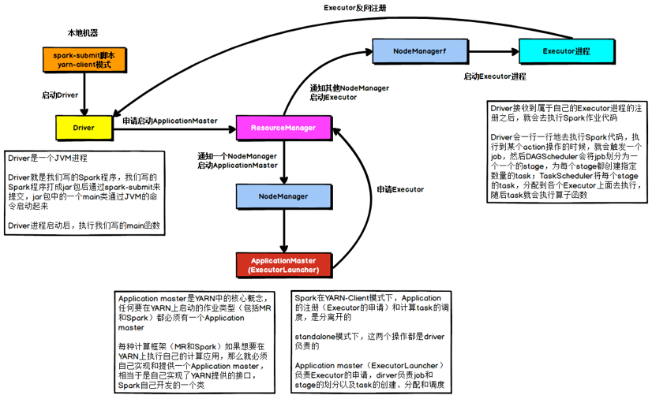
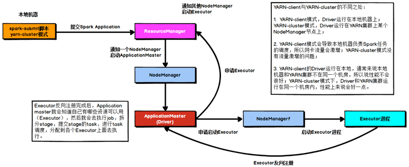

* [一、控制reduce端缓冲大小以避免OOM](#%E4%B8%80%E6%8E%A7%E5%88%B6reduce%E7%AB%AF%E7%BC%93%E5%86%B2%E5%A4%A7%E5%B0%8F%E4%BB%A5%E9%81%BF%E5%85%8Doom)
* [二、 JVM GC导致的shuffle文件拉取失败](#%E4%BA%8C-jvm-gc%E5%AF%BC%E8%87%B4%E7%9A%84shuffle%E6%96%87%E4%BB%B6%E6%8B%89%E5%8F%96%E5%A4%B1%E8%B4%A5)
* [三、解决各种序列化导致的报错](#%E4%B8%89%E8%A7%A3%E5%86%B3%E5%90%84%E7%A7%8D%E5%BA%8F%E5%88%97%E5%8C%96%E5%AF%BC%E8%87%B4%E7%9A%84%E6%8A%A5%E9%94%99)
* [四、解决算子函数返回NULL导致的问题](#%E5%9B%9B%E8%A7%A3%E5%86%B3%E7%AE%97%E5%AD%90%E5%87%BD%E6%95%B0%E8%BF%94%E5%9B%9Enull%E5%AF%BC%E8%87%B4%E7%9A%84%E9%97%AE%E9%A2%98)
* [四、解决YARN\-CLIENT模式导致的网卡流量激增问题](#%E5%9B%9B%E8%A7%A3%E5%86%B3yarn-client%E6%A8%A1%E5%BC%8F%E5%AF%BC%E8%87%B4%E7%9A%84%E7%BD%91%E5%8D%A1%E6%B5%81%E9%87%8F%E6%BF%80%E5%A2%9E%E9%97%AE%E9%A2%98)
* [五、解决YARN\-CLUSTER模式的 JVM栈 内存溢出无法执行问题](#%E4%BA%94%E8%A7%A3%E5%86%B3yarn-cluster%E6%A8%A1%E5%BC%8F%E7%9A%84-jvm%E6%A0%88-%E5%86%85%E5%AD%98%E6%BA%A2%E5%87%BA%E6%97%A0%E6%B3%95%E6%89%A7%E8%A1%8C%E9%97%AE%E9%A2%98)
* [七、解决 SparkSQL 导致的 JVM 栈内存溢出](#%E4%B8%83%E8%A7%A3%E5%86%B3-sparksql-%E5%AF%BC%E8%87%B4%E7%9A%84-jvm-%E6%A0%88%E5%86%85%E5%AD%98%E6%BA%A2%E5%87%BA)
* [八、持久化与checkpoint的使用](#%E5%85%AB%E6%8C%81%E4%B9%85%E5%8C%96%E4%B8%8Echeckpoint%E7%9A%84%E4%BD%BF%E7%94%A8)


--- 
# 一、控制reduce端缓冲大小以避免OOM
在Shuffle过程，reduce端task并不是等到map端task将其数据全部写入磁盘后再去拉取，而是map端写一点数据，reduce端task就会拉取一小部分数据，然后立即进行后面的聚合、算子函数的使用等操作。

reduce端task能够拉取多少数据，由reduce拉取数据的缓冲区buffer来决定，因为拉取过来的数据都是先放在buffer中，然后再进行后续的处理，buffer的默认大小为48MB。

reduce端task会一边拉取一边计算，不一定每次都会拉满48MB的数据，可能大多数时候拉取一部分数据就处理掉了。

虽然说增大reduce端缓冲区大小可以减少拉取次数，提升Shuffle性能，但是有时map端的数据量非常大，写出的速度非常快，此时reduce端的所有task在拉取的时候，有可能全部达到自己缓冲的最大极限值，即48MB，此时，再加上reduce端执行的聚合函数的代码，可能会创建大量的对象，这可难会导致内存溢出，即OOM。

如果一旦出现reduce端内存溢出的问题，我们可以考虑减小reduce端拉取数据缓冲区的大小，例如减少为12MB。

在实际生产环境中是出现过这种问题的，这是典型的以性能换执行的原理。reduce端拉取数据的缓冲区减小，不容易导致OOM，但是相应的，reudce端的拉取次数增加，造成更多的网络传输开销，造成性能的下降。

注意，要保证任务能够运行，再考虑性能的优化。

# 二、 JVM GC导致的shuffle文件拉取失败
在Spark作业中，有时会出现shuffle file not found的错误，这是非常常见的一个报错，有时出现这种错误以后，选择重新执行一遍，就不再报出这种错误。

出现上述问题可能的原因是Shuffle操作中，后面stage的task想要去上一个stage的task所在的Executor拉取数据，结果对方正在执行GC，执行GC会导致Executor内所有的工作现场全部停止，比如BlockManager、基于netty的网络通信等，这就会导致后面的task拉取数据拉取了半天都没有拉取到，就会报出shuffle file not found的错误，而第二次再次执行就不会再出现这种错误。

可以通过调整reduce端拉取数据重试次数和reduce端拉取数据时间间隔这两个参数来对Shuffle性能进行调整，增大参数值，使得reduce端拉取数据的重试次数增加，并且每次失败后等待的时间间隔加长。

```scala
val conf = new SparkConf()
  .set("spark.shuffle.io.maxRetries", "60")
  .set("spark.shuffle.io.retryWait", "60s")
```

# 三、解决各种序列化导致的报错
当 Spark 作业在运行过程中报错，而且报错信息中含有Serializable等类似词汇，那么可能是序列化问题导致的报错。
序列化问题要注意以下三点：
1. 作为RDD的元素类型的自定义类，必须是可以序列化的；
2. 算子函数里可以使用的外部的自定义变量，必须是可以序列化的；
3. 不可以在RDD的元素类型、算子函数里使用第三方的不支持序列化的类型，例如Connection。

# 四、解决算子函数返回NULL导致的问题
在一些算子函数里，需要我们有一个返回值，但是在一些情况下我们不希望有返回值，此时我们如果直接返回NULL，会报错，例如Scala.Math(NULL)异常。

如果你遇到某些情况，不希望有返回值，那么可以通过下述方式解决：
1. 返回特殊值，不返回NULL，例如“-1”；
2. 在通过算子获取到了一个RDD之后，可以对这个RDD执行filter操作，进行数据过滤，将数值为-1的数据给过滤掉；
3. 在使用完filter算子后，继续调用coalesce算子进行优化。

# 四、解决YARN-CLIENT模式导致的网卡流量激增问题


在 YARN-client 模式下，Driver 启动在本地机器上，而 Driver 负责所有的任务调度，需要与 YARN 集群上的多个 Executor 进行频繁的通信。

假设有100个Executor， 1000个task，那么每个Executor分配到10个task，之后，Driver要频繁地跟Executor上运行的1000个task进行通信，通信数据非常多，并且通信品类特别高。这就导致有可能在Spark任务运行过程中，由于频繁大量的网络通讯，本地机器的网卡流量会激增。

注意，YARN-client模式只会在测试环境中使用，而之所以使用YARN-client模式，是由于可以看到详细全面的log信息，通过查看log，可以锁定程序中存在的问题，避免在生产环境下发生故障。

在生产环境下，使用的一定是YARN-cluster模式。在YARN-cluster模式下，就不会造成本地机器网卡流量激增问题，如果YARN-cluster模式下存在网络通信的问题，需要运维团队进行解决。

# 五、解决YARN-CLUSTER模式的 JVM栈 内存溢出无法执行问题


当 Spark 作业中包含 SparkSQL 的内容时，可能会碰到YARN-client模式下可以运行，但是YARN-cluster模式下无法提交运行（报出OOM错误）的情况。

YARN-client 模式下，Driver 是运行在本地机器上的，Spark 使用的 JVM 的 PermGen 的配置，是本地机器上的spark-class文件，JVM 永久代的大小是128MB，这个是没有问题的，但是在 YARN-cluster 模式下，Driver运行在YARN集群的某个节点上，使用的是没有经过配置的默认设置，PermGen永久代大小为82MB。

SparkSQL的内部要进行很复杂的SQL的语义解析、语法树转换等等，非常复杂，如果sql语句本身就非常复杂，那么很有可能会导致性能的损耗和内存的占用，特别是对PermGen的占用会比较大。

所以，此时如果PermGen的占用好过了82MB，但是又小于128MB，就会出现YARN-client模式下可以运行，YARN-cluster模式下无法运行的情况。

解决上述问题的方法时增加PermGen的容量，需要在spark-submit脚本中对相关参数进行设置，设置方法如下代码
```scala
--conf spark.driver.extraJavaOptions="-XX:PermSize=128M -XX:MaxPermSize=256M"
```
通过上述方法就设置了Driver永久代的大小，默认为128MB，最大256MB，这样就可以避免上面所说的问题。\


# 七、解决 SparkSQL 导致的 JVM 栈内存溢出
当SparkSQL的sql语句有成百上千的or关键字时，就可能会出现Driver端的JVM栈内存溢出。

JVM栈内存溢出基本上就是由于调用的方法层级过多，产生了大量的，非常深的，超出了 JVM 栈深度限制的递归。（我们猜测SparkSQL有大量or语句的时候，在解析SQL时，例如转换为语法树或者进行执行计划的生成的时候，对于or的处理是递归，or非常多时，会发生大量的递归）

此时，建议将一条sql语句拆分为多条sql语句来执行，每条sql语句尽量保证100个以内的子句。根据实际的生产环境试验，一条sql语句的or关键字控制在100个以内，通常不会导致JVM栈内存溢出


# 八、持久化与checkpoint的使用
Spark持久化在大部分情况下是没有问题的，但是有时数据可能会丢失，如果数据一旦丢失，就需要对丢失的数据重新进行计算，计算完后再缓存和使用，为了避免数据的丢失，可以选择对这个RDD进行checkpoint，也就是将数据持久化一份到容错的文件系统上（比如HDFS）。

一个RDD缓存并checkpoint后，如果一旦发现缓存丢失，就会优先查看checkpoint数据存不存在，如果有，就会使用checkpoint数据，而不用重新计算。也即是说，checkpoint可以视为cache的保障机制，如果cache失败，就使用checkpoint的数据。

使用checkpoint的优点在于提高了Spark作业的可靠性，一旦缓存出现问题，不需要重新计算数据，缺点在于，checkpoint时需要将数据写入HDFS等文件系统，对性能的消耗较大。


---

<h1> 未完待续... </h1>